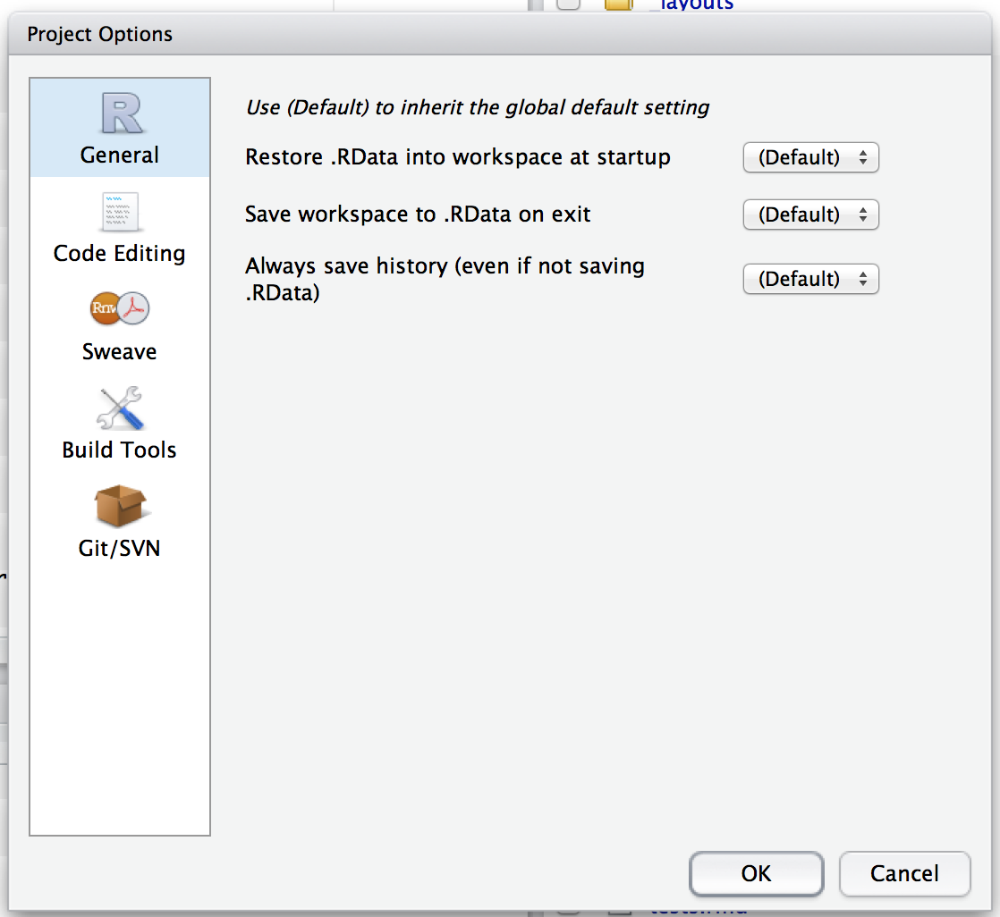
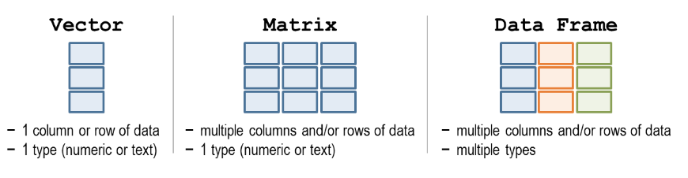

# Introduction

Useful references:

* Hadley Wickham's [Advanced R](http://adv-r.had.co.nz/) and [R for data science](https://r4ds.had.co.nz/) (Answers to questions by [jrnold](https://jrnold.github.io/r4ds-exercise-solutions/))
* [Technical foundations of informatics](https://info201.github.io/control-structures.html)
* CRAN contributed [documentation](https://cran.r-project.org/other-docs.html)
* [STHDA](http://www.sthda.com/english/)

R comes as a single binary executable file and large number of functions. The binary file has been compiled from source code written using C. Most of the analytic functions are written in R, other languages such as C and fortran are used to write the most fundamental R functions. 

## R files

* .rdata = saves the objects that exist in a session (i.e. everything in environment). If you load .rdata all the objects will be loaded. These objects are part of your 'workspace'. When you quit R, it asks if you want to save your workspace by default (you can change this in Tools > Global options). It is referring to all the objects in your environment.
* .rhistory = saves the commands you have executed
* .R = R script
* .Rmd = R markdown file (R markdown or R notebooks saved thus)
* .html = R notebooks can create html file (you can change the output by changing (“output: html_notebook”) at the start of the notebook.).
* .Rproj.user = hidden directory, where project specific temp files are stored. This file is automatically added to .gitignore. 

* .rprofile = configuration file, usually does not exist in a fresh install

### Memory

R sets the environment variable 'R_MAX_VSIZE' which specifies the maximal vector heap size. It is generally set to the max of: 16GB and available physical memory. This is to avoid having the R process killed when OS over-commits memory.

You can override this by creating a temporary environment variable or changing R_MAX_VSIZE in the file '.Renviron'.

You do risk over allocating and killing the process though.

See [this](https://stackoverflow.com/questions/51248293/error-vector-memory-exhausted-limit-reached-r-3-5-0-macos) SO question for more.

### R project

R projects is a RStudio product that 'makes it straightforward to divide your work into multiple contexts, each with their own working directory, workspace, history, and source documents'. Starting a new project creates a .rproj file in the specified working directory. This file contains various project options and can be used as a shortcut for opening the project from the file system. Also creates a hidden directory (.Rproj.user) to store temporary project specific files. 

It is associated with a R working directory but can be created in a directory with existing R code and data.

It stores 'metadata' such that when you close your RStudio session, it saves your .rdata and .rhistory, information about your window state, active tabs to your working direction. When you open the same project, it loads all these files and settings and sets your working directory to the one of this project - so your new session looks just as it were before you closed the project. Scripts (.r or .rmd) files are stored separately.

The .rproj file is just a text file and looks like this (this is a R package project): 

```
Version: 1.0

RestoreWorkspace: No
SaveWorkspace: No
AlwaysSaveHistory: Default

EnableCodeIndexing: Yes
Encoding: UTF-8

AutoAppendNewline: Yes
StripTrailingWhitespace: Yes

BuildType: Package
PackageUseDevtools: Yes
PackageInstallArgs: --no-multiarch --with-keep.source
PackageRoxygenize: rd,collate,namespace
```

To modify go into projects menu on the top RHS of RStudio > Project Options:


See [RStudio](https://support.rstudio.com/hc/en-us/articles/200526207-Using-Projects) and [R pacakges](http://r-pkgs.had.co.nz/package.html) for more details.

## Packages

A package bundles together code, data, documentation, and tests and is an easy way to share code with others. Most are hosting on [CRAN](http://cran.us.r-project.org/). 

* `install.packages(“dplyr”)` - downloads package from the internet onto your computer. Package name needs to be in quotes. These are downloaded from CRAN.
* `library(‘dplyr’)` - Opens the library into the current R session. Does NOT need to be quoted. 
* `installed.packages()` - Shows you what packages are installed
* `update.package()`
* `remove.package()`

On Linux (and maybe Macs?) I've found that problems installing packages in R can sometimes be solved by installing using terminal e.g. `sudo apt-get install r-cran-rgl`.

To make clear where a function is coming from you can use: `package::function()`  e.g. `dplyr::mutate()`

When you load a package it may warn you of 'conflicts' - this means that some function names of the package are the same as the function name in r-base. This may be because the package has 'improved' or changed the base r function intentionally. To use the original r-base function you must fully specify the function to make clear where it is coming from. E.g. for dplyr, `filter()` is a conflict. To use base-r function: `stats::filter()`

### Library

A library is a directory containing your installed packages. You generally have 2:

* One for packages that come with every R installation (base, stats etc)
* One for packages that you have installed. They are normally based on the version of R you are using (e.g. if you have have a folder named '3.4', packages installed when using this R version will be stored here). Sometimes it may seems like you lose all of your packages when you reinstall R — they’re still on your hard drive, but R can’t find them.

`.libPaths()` tells you which libraries are currently active.

When you use `library(package)`, R will look through each path in .libPaths to see if a directory called 'package' exists.

See [Advanced R](http://r-pkgs.had.co.nz/package.html) for more and [this](https://stackoverflow.com/questions/24880493/how-to-find-out-r-library-location-in-mac-osx) SO question to find the location of installed packages.

### Bioconductor

Bioconductor is a source of open source software especially for genomic data analysis. 

To download packages from bioconductor you will need the top two functions: 

```{r, eval=FALSE}
source("http://bioconductor.org/biocLite.R")  # Downloads installer script
biolite(“limma”)        # installer function

biolite()               #this will install core packages or update any installed packages
```


## Basics

* alt + shift + k - shows list of keyboard shortcuts.
* Indexing is base 1 (i.e. you start counting from 1) 
* Everything is an object in R. Class is blueprint for object, and object is something created using blueprint for object. Many objects can be made from one blueprint/for one class.
* Create an object by assigning them.
    * Assign variable using `<-`. You can also use `=` but this is not advised according to R style guides. 
    * There is a difference between `<-` and `=`. With `<-` you can a assign a variable during a function call e.g. `f(x <- 3)` - which means 'assign 3 to x, and call f with the first argument set to the value 3'. See this [blog](https://blog.revolutionanalytics.com/2008/12/use-equals-or-arrow-for-assignment.html) for more.
    * `get()` will return the value of a named object
    
```{r}
var1 = "Ice bear"
get("var1")
```

The object name needs to be given as character string. Without quotes this occurs:

```{r, error=TRUE}
get(var1)
```

Without quotes it evaluates var1, the result of which is a string called 'Ice bear'. It then searches for a variable called 'Ice bear'.

* To set working directory: `setwd:('D:/path to wd')` or via session -> set working directory.
    * `getwd()` to get the working directory.
* To cancel commands use Esc. If R is waiting for you to finish code, a `+` will be shown in the console instead of `>`.
Comparing numbers: ‘==’ fine for integers but use all.equal() for decimals due to machine representing decimals to certain precision, ‘machine numeric tolerance’
* Environment - Objects created in for loops are global objects and objects created in functions are local (See [Advanced R](http://adv-r.had.co.nz/Environments.html) for more).
* `&` is vectorised and `&&` is not. Similar for `|` and `||`. See [this](https://stackoverflow.com/questions/6558921/boolean-operators-and) SO question for more.
* `12 | 3` is evaluated to be TRUE because if you coerce a number into a logical, any non-zero number will be TRUE and 0 will be FALSE. Thus `12 | 3` is essentially `TRUE | TRUE` which is `TRUE`.

```{r}
as.logical(0)
```

```{r}
as.logical(-3)
```


### Arithmetic

* When comparing numbers `==` fine for integers but use `all.equal()` for decimals due to machine representing decimals to certain precision ('machine numeric tolerance').
    * `identical()` - 'the safe and reliable way to test two objects for being exactly equal' Different from `all.equal()` which allows for small differences in NUMERIC results.
* Integer division: divide then round down - `598 %/% 100 = 5`
* Remainder: Gives remainder after division - `598 %% 100 = 98`

## Help

To access the help file for an object use `?function_name` or `help(function_name)`.

If you don’t really know the function, you can do a fuzzy search - `??function_name`.

A summary of packages broken down by topic can be found at [CRAN](https://cran.r-project.org/web/views/)

When asking for help online these functions will be useful:

* `dput()` - will dump the data you’re working with into a format so that it can be copy and pasted by anyone else into their R session.
* `sessionInfo()` - will print out your current version of R, as well as any packages you have loaded. This can be useful for others to help reproduce and debug your issue.

## Data types

* Double (dbl) - decimal e.g. 3.14
* Integer (int) - No decimal e.g. 1 (can be 1L, the L suffix denotes? integer)
* Complex - imaginary number e.g. 1i
* Logical (lgl) - Boolean, TRUE or FALSE (T or F)
* Character (chr) - String
* Factor (fctr) - Categorical values
* Date time (dttm) - Date and time
* Date (date) - Date

### Numeric

Numbers are usually stored as class = numeric. Numeric actually consists of multiple classes: integer, single precision and double precision (the last classes are floating point numbers). This is because R will automatically convert between the numeric classes when needed, thus it does not matter to the casual user if the number '3' is stored as double or integer. Note that most calculations are done using doubles (as they are more flexible and  higher range of values can be expressed as double), thus this is the default storage. However, integers require less space, thus if you have large data structure, that will never need to be converted into double, you can specify it to be stored as integer. 

Putting a 'L' at the end of a number forces it to be an integer (you cannot do this if the number has a decimal point in it). `1:3` will also return a vector of integers.

See [this](https://stackoverflow.com/questions/23660094/whats-the-difference-between-integer-class-and-numeric-class-in-r) SO question for more.

### Coercion

All elements of an atomic vector must be the same type, so when you attempt to combine different types they will be coerced to the most flexible type. This way no data is lost.

logical  ->  integer  ->  double  ->  complex -> character (*most flexible*)

When a logical vector is coerced into an integer or double, TRUE=1 and FALSE=0. This can be useful to calculate `sum()` (total number of trues) and mean() (proportion of trues).

Coercion often happens automatically. Mathematical functions will coerce to double or integer and logical operations (`|`, `&`, `any()`) will coerce to logical. You will usually get a warning message if coercion may cause loss of information.

Some string functions will coerce factors to strings e.g. `gsub()` and `grepl()`. Some will throw an error, e.g. `nchar()`. Some will use the underlying integer values `c()`. It is best to explicitly convert factor vectors to string if you need to perform string functions

### Factors

Factors are integers 'under the hood' - each number corresponds to a level.
`typeof(factor)` will be integer BUT `class(factor)` will be factor.

R can store nominal (categorical data) as factors. R will store the nominal values as a vector of integers. (e.g. nominal values are: red, green, blue, R will associate 1 = red, 2 = blue, 3 = green, and store them as such). The "level's" are stored as 'attributes' found with the function `attributes()`.

```{r}
my_fact <- as.factor(c("red", "blue"))
attributes(my_fact)
```

If data is stored as a factor will treat as categorical data or ordinal data in statistical analysis. This, it can be useful when you know all the values a variable can take. However, you can’t add another nominal value that does not already exist, unless you add that nominal value first. 

Factors can also be used to store ordinal data (i.e small, medium large - data with order but where the intervals not necessarily equal) as ordered factors. 

E.g. a variable coded as "large", "medium" & "small' - 
`rating <- ordered(rating)` recodes rating to 1,2,3 and associates 1=large, 2=medium, 3=small internally. R now treats `rating` as ordinal.

A variable can be converted to a factor using `as.factor()` or `factor()`. The difference between these two functions is that `as.factor()` is like a wrapper for `factor()` that allows quick return if the input vector is already a factor. Performance of `as.factor()` is thus better if the input is already a factor. 'Quick return' will leave factor levels as they are while factor() will not. See [this](https://stackoverflow.com/questions/39279238/r-why-use-as-factor-instead-of-just-factor) SO question for more.

#### Changing factor order

You can use options in the `factor()` and `ordered()` functions to control the mapping of integers to strings (overriding the alphabetical ordering).

E.g.
```{r}
mydata <- c("case", "control", "control", "case")
factor_ordering_example <- factor(mydata, levels = c("control", "case"))
```

This tells R that control = 1 and case = 2.

```{r}
str(factor_ordering_example)
```

#### Factors during parsing

It may not be immediately obvious that a column is stored as factors. When parsing in data there is an option of not using factors. By default, R always transforms character vectors to factors when creating a dataframe with character vectors or converting a character matrix to a dataframe. 

A problem with this default behaviour is that it will convert numerical columns of data into a factor if there is a non-numeric value in your column (e.g. a missing value encoded by a character). This can be a nasty cause of errors in your code if you’re not aware of it. 

To convert factor data into numeric: 

1. remove all character values
2. convert to character 
3. convert to numeric. 

If you just convert straight to double/integer without going through character, you will get the numeric levels of the factor instead of the actual data (levels) of the data. 

You can avoid R converting character data into factors by specifying the argument `stringsAsFactors=FALSE` when reading in data. 

Or use `na.strings` is also useful, to specify what should be read in as NA.

## Data structures

| Dimensions | Homogenous    | Heterogenous |
|:----------:|:-------------:|:------------:|
| 1D         | Atomic vector | List         |
| 2D         | Matrix        | Dataframe    |
| nD         | Array         |              |



* Vector is an umbrella term for both atomic vectors and lists, however most people mean atomic vector when they talk about 'vectors'. 
* Matrices and dataframes can be '1D' (by having only one column or row) but will behave differently from vector.
* In a dataframe, different columns can contain different data types but all data within one column has to be the same data type.
* There are no scalar values (0d), individual values are actually atomic vectors with length 1.
* The function `str()` (structure) is useful to find out the structure of ab object. 
    * If you are using `print(str(c(1,2))`, there will be a NULL added to the end of that print. This is because the result of `str()` has a class NULL. Note that you do not need to add `print()` because `str()` prints by default.


### Atomic vector

All elements must be same type (mode). All elements have to be of a basic ‘atomic’ vector data type:

**Typeof**|**mode**|**storage.mode**
:-----:|:-----:|:-----:
Logical|logical|logical
Integer|numeric|integer
Double|numeric|double
Complex|complex|complex
Character|character|character
Raw|raw|raw

* Create with `c()` which means means combine or concatenate. 
* Many arithmetic operations are 'vectorised', this means that if you perform an arithmetic function on a dataframe, the result be a dataframe. 
* You can test if an object is an atomic vector using `is.atomic()`.
    - `is.vector()` returns true if the object is a vector with no attributes apart from names.
    - use `is.character()`, `is.double()`, `is.integer()`, `is.logical()` to test a vector to see what data type it is composed of.
    - `is.numeric()`, is a general test for numberliness and will return true for both integer and double vectors. 

### Lists

A list is a 1D ordered collection of objects. Each element can be of any datatype and data structure. For example, you can have a list of lists.

```{r}
l1 <- list(list(1, 2), c(3, 4))
l2 <- c(list(1, 2), c(3, 4))
str(l2)
```

`c()` will combine several lists into a vector. If given both atomic vectors and lists, will coerce atomic vector into a list before combining.

Lists are sometimes called recursive vectors as lists can contain other lists. This makes them fundamentally different from atomic vectors, which are 'flat'.

```{r}
l <- list(list(list(list())))
str(l)
```

```{r}
l <- c(1, c(2, c(3, 4)))
str(l)
```

`unlist()` will turn a list into an atomic vector, if there are different data types in the list, it will coerce them to be the same type. `as.vector()` will not do this. 

### Matrix

2D data structure, made up of vectors. All vectors must be of the same data type.

Create using:
```{r, eval=FALSE}
matrix(vector, nrow=x, ncol=y, byrow=FALSE    #matrix fills by columns, which is the default. 
       dimnames=(row_names, column_names))    #name your cols and rows
```

Can also modify a vector into a matrix by setting the `dim()` attribute. 
```{r}
v <- 1:6
dim(v) <- c(3, 2)

class(v)
```

You can have matrix where each ELEMENT is a list!
```{r}
m_list<-matrix(list('1',2,3,4),2,2)
m_list
```

Here the output looks like the matrix is of character and integer. However, each element in the matrix is a list of one!

```{r}
m1 <- matrix(c(list(1), list(2), list(3), list(4)), 2, 2)
str(m1)
typeof(m1)
```

```{r}
m2 <- matrix(1:4, 2, 2)
str(m2)
typeof(m2)
```

### Array

An array is like a matrix but can have >2 dimensions. 

Like vectors, the content of the array is stored in a vector in column-major order and the dim attribute is a vector of integers specifying the respective extents of the array. There is no difference between a matrix and a 2D array.

### Dataframes

Dataframes consist of a list of equal length vectors. `class()` is dataframe but `typeof()` gives list. `length()` will give the length of the list (i.e. `ncol()`). 

You can create a dataframe by joining vectors:
```{r}
employee <- c('John Doe','Peter Gynn','Jolie Hope')
salary <- c(21000, 23400, 26800)
employ.data <- data.frame(employee, salary) 
```

`cbind()` (with vectors) will create matrix unless one of the arguments is already a dataframe.

When combining column-wise, the number of rows must match, but row names are ignored. When combining row-wise, both the number and names of columns must match. You an use `plyr::rbind.fill()` to combine data frames that don’t have the same columns.

You can also coerce an object to a data frame with `as.data.frame()`.

* A vector will create a one-column data frame.
* A list will create one column for each element; there will be an error if they’re not all the same length.
* A matrix will create a dataframe with the same number of columns and rows as the matrix.

It is possible to store a list as a column in a dataframe: 

```{r}
df <- data.frame(x = 1:3)
df$y <- list(1:2, 1:3, 1:4)
df
```

However, this will give an error as it tries to put each item of the list into its own column, which fails as they have different number of rows.

```{r, error=TRUE}
data.frame(x = 1:3, y = list(1:2, 1:3, 1:4))
```

You can use `I()`, which causes the dataframe to treat list as one unit:

```{r}
dfl <- data.frame(x = 1:3, y = I(list(1:2, 1:3, 1:4)))
dfl
```

```{r}
str(dfl)
```

The class AsIs is added but this can be safely ignored.

It is NOT wise to do this though as many functions that work on dataframes will assume that all columns are atomic vectors.

You can subsetting dataframe a number of different ways:
```{r, eval=FALSE}
name_of_table$name_of_column
name_of_table[row,column]   
name_of_table[,c('name_of_col_1')] 
```

### High dimension structures

The high dimension equivalent of vector functions:

* `length()` - `dim()`. You can also use `row()` and `ncol()` for matrices.
* `names()` - `dimnames()` outputs a list of character vectors of the names. You can also use `rownames()` and `colnames()` for matrices.
* `c()` - `cbind()` and `rbind()`

There is a `drop` argument when using `[ ]` to subset high dimension data structures. Drop = Drop Redundant Extent Information. It is a logical which determines whether the dimensions of an array which have only one level should be deleted.

What is does is, when subsetting to get only one row/column (from a matrix/array), you can set drop=TRUE to get a vector.

If drop=FALSE, you get the same data structure, but with just one row.

See [this](https://discuss.analyticsvidhya.com/t/what-does-the-drop-f-argument-in-a-matrix-do-in-r/1586/2) question for more.  

### Attributes

All objects can have attributes, used to store metadata about the object. They can be thought of as a named list. 

```{r}
y <- 1:10
attr(y, "my_attribute") <- "This is a vector" 
# create an attribute called “my_attribute” and give it some content
attr(y, "my_attribute")         
# access an individual attribute with attr()
```

```{r}
str(attributes(y))        
```

`structure()` (instead of `str()`) will return the object with attribute set as well.

```{r}
structure(y)
```

By default you lost most (NOT all) attributes when modifying a vector.

```{r}
attributes(sum(y))
```

Attributes you don’t lose:

* Names
* Dimensions (can be used to turn vectors into matrices and arrays)
* Class

Each of these attributes has a special accessor function; `names()`, `dim()`, `class()`. (Do not use `attr(x, 'names')`)

#### Names

You can name a vector a number of ways:

```{r}
x <- c(a = 1, b = 2, c = 3)
x <- 1:3; names(x) <- c("a", "b", "c")
x <- 1:3; names(x)[[1]] <- c("a")
x <- setNames(x, c("a", "b", "c"))    #assigns names to an object and returns the object
```


* Names don’t have to be unique but you can subset by names when they are
* Not all elements need to have a name. If some are missing when you create the vector the name will be set to be an empty string
    * However if you modify a vector 'in place' by setting name, `names()` will return NA for the missing ones.

```{r}
y <- c(a = 1, 2, 3)
names(y)
```

```{r}
v <- c(1, 2, 3)
names(v) <- c('a')
names(v)
```

If all names are missing, `names()` will return NULL.

```{r}
z <- c(1, 2, 3)        
names(z)
```

* To remove names from vector use `names(x) <- NULL` or `unname()`.
* There is a package called 'sticky' which will force defined attributes to be kept - as they are lost when common functions (e.g. subset/extend/extract are used).

## NAs

NAs = not availables

'NAs are contagious' - most equations involving NA returns NA. 

If there is a NA value, `mean()` will return NA. It makes sense that the mean of a group of numbers plus a missing value that could be anything is NA.

To get it to return the mean of the non-missing values use `mean(x, na.rm=TRUE)`

As all values in an atomic vector must be of the same data type, there are several 'types' of NAs. 

The default type is logical:

```{r}
str(NA)
```

NA will be coerced into the correct type if used within `c()`.

```{r}
v <- c(1,2,3,4,5, NA)
str(v[6])
```

```{r}
v <- c("one", "two", "three", NA)
str(v[4])
```

Many functions will have a `na.rm` argument. You can also remove NA's using `is.na()`.

```{r}
v <- c(1,2,3,NA)
is.na(v)
```

```{r}
v[! is.na(v)]
```

In certain equations, including NA will not return NA. This is when the result of the operation would be the same for all possible values of NA:

```{r}
NA ^ 0
```

This is because any number to the power of 0 is 1 (including 0^0).

```{r}
NA | TRUE
```

Here TRUE is returned and NOT NA because no matter if the NA value is TRUE or FALSE, both will be TRUE.

It is ignored by functions such as `filter()`.

#### NA vs NaN

There is a difference.

* NaN - Not a Number e.g. undefined calculations such as 3/0. Exists only as double type for real or imaginary components of the complex type.
    * `is.nan()` only checks for NaN. Does not return true for NAs. `is.na()` returns TRUE for NA and NaNs.
    * When matching - NaN will match NaN only (not NA).
* NA - Not Available - usually a missing value. From R1.5.0 the string 'NA' is distinct from NA of character type. String 'NA' should be written as `as.character(NA)`.

For more see [this](https://www.r-bloggers.com/difference-between-na-and-nan-in-r/) blog.

## Saving objects

You can save objects in your environment as a .Rdata file using `save()` and laod then into a new session using `load()`.

YiHui recommends `saveRDS()` and `loadRDS()` because you can silently overwrite current object using `save()` and `load()`.

### feather

The feather package allows you to save objects in fast binary format that can be shared across programming languages (i.e. usable outside of R). Tends to be faster than 'RDS'.

```{r, eval=FALSE}
library(feather)
write_feather(challenge, "challenge.feather")
read_feather("challenge.feather")
```


