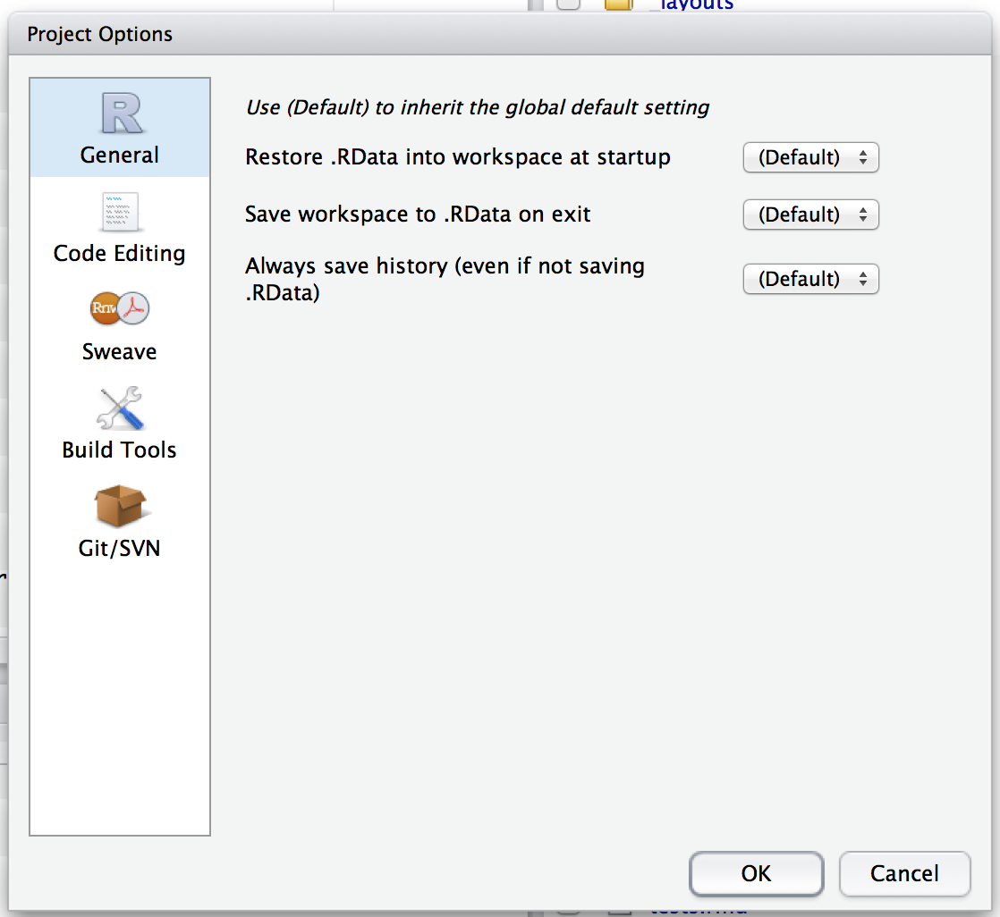
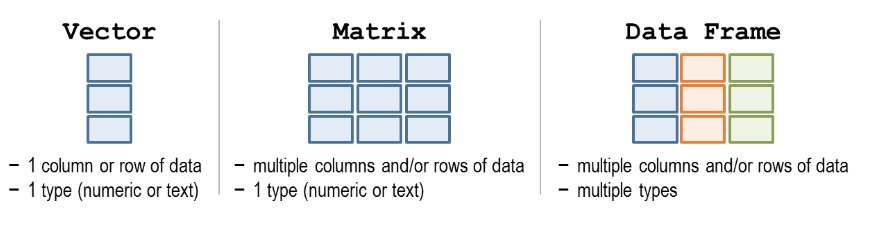
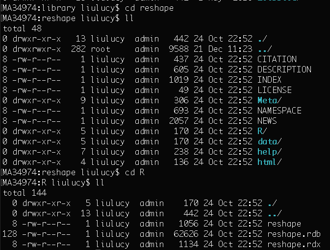
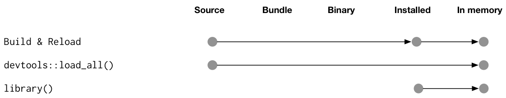
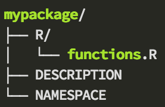
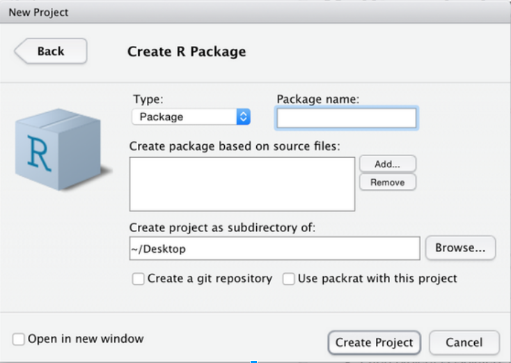
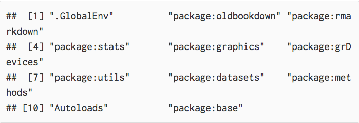
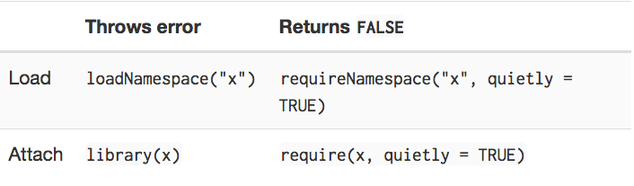

--- 
title: "R notes"
author: "Lucy Liu"
date: "`r Sys.Date()`"
site: bookdown::bookdown_site
output: bookdown::gitbook
documentclass: book
# bibliography: [book.bib, packages.bib]
# biblio-style: apalike
# link-citations: yes
github-repo: lucyleeow/R_notes
description: "Guide to R."
---

# Preface

These are my notes on R.

I used the bookdown package by [YiHui Xie](https://yihui.name/en/). In particular the bookdown [book](https://bookdown.org/yihui/bookdown/) was very thorough and extrememly useful.

<!--chapter:end:index.Rmd-->

# Introduction

Useful references:

* Hadley Wickham's [Advanced R](http://adv-r.had.co.nz/) and [R for data science](https://r4ds.had.co.nz/) (Answers to questions by [jrnold](https://jrnold.github.io/r4ds-exercise-solutions/))
* [Technical foundations of informatics](https://info201.github.io/control-structures.html)
* CRAN contributed [documentation](https://cran.r-project.org/other-docs.html)
* [STHDA](http://www.sthda.com/english/)

R comes as a single binary executable file and large number of functions. The binary file has been compiled from source code written using C. Most of the analytic functions are written in R, other languages such as C and fortran are used to write the most fundamental R functions. 

## R files

* .rdata = saves the objects that exist in a session (i.e. everything in environment). If you load .rdata all the objects will be loaded. These objects are part of your 'workspace'. When you quit R, it asks if you want to save your workspace by default (you can change this in Tools > Global options). It is referring to all the objects in your environment.
* .rhistory = saves the commands you have executed
* .R = R script
* .Rmd = R markdown file (R markdown or R notebooks saved thus)
* .html = R notebooks can create html file (you can change the output by changing (“output: html_notebook”) at the start of the notebook.).
* .Rproj.user = hidden directory, where project specific temp files are stored. This file is automatically added to .gitignore. 

* .rprofile = configuration file, usually does not exist in a fresh install

### Memory

R sets the environment variable 'R_MAX_VSIZE' which specifies the maximal vector heap size. It is generally set to the max of: 16GB and available physical memory. This is to avoid having the R process killed when OS over-commits memory.

You can override this by creating a temporary environment variable or changing R_MAX_VSIZE in the file '.Renviron'.

You do risk over allocating and killing the process though.

See [this](https://stackoverflow.com/questions/51248293/error-vector-memory-exhausted-limit-reached-r-3-5-0-macos) SO question for more.

### R project

R projects is a RStudio product that 'makes it straightforward to divide your work into multiple contexts, each with their own working directory, workspace, history, and source documents'. Starting a new project creates a .rproj file in the specified working directory. This file contains various project options and can be used as a shortcut for opening the project from the file system. Also creates a hidden directory (.Rproj.user) to store temporary project specific files. 

It is associated with a R working directory but can be created in a directory with existing R code and data.

It stores 'metadata' such that when you close your RStudio session, it saves your .rdata and .rhistory, information about your window state, active tabs to your working direction. When you open the same project, it loads all these files and settings and sets your working directory to the one of this project - so your new session looks just as it were before you closed the project. Scripts (.r or .rmd) files are stored separately.

The .rproj file is just a text file and looks like this (this is a R package project): 

```
Version: 1.0

RestoreWorkspace: No
SaveWorkspace: No
AlwaysSaveHistory: Default

EnableCodeIndexing: Yes
Encoding: UTF-8

AutoAppendNewline: Yes
StripTrailingWhitespace: Yes

BuildType: Package
PackageUseDevtools: Yes
PackageInstallArgs: --no-multiarch --with-keep.source
PackageRoxygenize: rd,collate,namespace
```

To modify go into projects menu on the top RHS of RStudio > Project Options:


See [RStudio](https://support.rstudio.com/hc/en-us/articles/200526207-Using-Projects) and [R pacakges](http://r-pkgs.had.co.nz/package.html) for more details.

## Packages

A package bundles together code, data, documentation, and tests and is an easy way to share code with others. Most are hosting on [CRAN](http://cran.us.r-project.org/). 

* `install.packages('dplyr')` - downloads package from the internet onto your computer. Package name needs to be in quotes. These are downloaded from CRAN.
* `library('dplyr')` - Opens the library into the current R session. Does NOT need to be quoted. 
* `installed.packages()` - Shows you what packages are installed
* `update.package()`
* `remove.package()`

On Linux (and maybe Macs?) I've found that problems installing packages in R can sometimes be solved by installing using terminal e.g. `sudo apt-get install r-cran-rgl`.

To make clear where a function is coming from you can use: `package::function()`  e.g. `dplyr::mutate()`

When you load a package it may warn you of 'conflicts' - this means that some function names of the package are the same as the function name in r-base. This may be because the package has 'improved' or changed the base r function intentionally. To use the original r-base function you must fully specify the function to make clear where it is coming from. E.g. for dplyr, `filter()` is a conflict. To use base-r function: `stats::filter()`

### Library

A library is a directory containing your installed packages. You generally have 2:

* One for packages that come with every R installation (base, stats etc)
* One for packages that you have installed. They are normally based on the version of R you are using (e.g. if you have have a folder named '3.4', packages installed when using this R version will be stored here). Sometimes it may seems like you lose all of your packages when you reinstall R — they're still on your hard drive, but R can't find them.

`.libPaths()` tells you which libraries are currently active.

When you use `library(package)`, R will look through each path in .libPaths to see if a directory called 'package' exists.

See [Advanced R](http://r-pkgs.had.co.nz/package.html) for more and [this](https://stackoverflow.com/questions/24880493/how-to-find-out-r-library-location-in-mac-osx) SO question to find the location of installed packages.

### Bioconductor

Bioconductor is a source of open source software especially for genomic data analysis. 

To download packages from bioconductor you will need the top two functions: 

```{r, eval=FALSE}
source("http://bioconductor.org/biocLite.R")  # Downloads installer script
biolite(“limma”)        # installer function

biolite()               #this will install core packages or update any installed packages
```


## Basics

* alt + shift + k - shows list of keyboard shortcuts.
* Indexing is base 1 (i.e. you start counting from 1) 
* Everything is an object in R. Class is blueprint for object, and object is something created using blueprint for object. Many objects can be made from one blueprint/for one class.
* Create an object by assigning them.
    * Assign variable using `<-`. You can also use `=` but this is not advised according to R style guides. 
    * There is a difference between `<-` and `=`. With `<-` you can a assign a variable during a function call e.g. `f(x <- 3)` - which means 'assign 3 to x, and call f with the first argument set to the value 3'. See this [blog](https://blog.revolutionanalytics.com/2008/12/use-equals-or-arrow-for-assignment.html) for more.
    * `get()` will return the value of a named object
    
```{r}
var1 = "Ice bear"
get("var1")
```

The object name needs to be given as character string. Without quotes this occurs:

```{r, error=TRUE}
get(var1)
```

Without quotes it evaluates var1, the result of which is a string called 'Ice bear'. It then searches for a variable called 'Ice bear'.

* To set working directory: `setwd:('D:/path to wd')` or via session -> set working directory.
    * `getwd()` to get the working directory.
* To cancel commands use Esc. If R is waiting for you to finish code, a `+` will be shown in the console instead of `>`.
Comparing numbers: '==' fine for integers but use all.equal() for decimals due to machine representing decimals to certain precision, 'machine numeric tolerance'
* Environment - Objects created in for loops are global objects and objects created in functions are local (See [Advanced R](http://adv-r.had.co.nz/Environments.html) for more).
* `&` is vectorised and `&&` is not. Similar for `|` and `||`. See [this](https://stackoverflow.com/questions/6558921/boolean-operators-and) SO question for more.
* `12 | 3` is evaluated to be TRUE because if you coerce a number into a logical, any non-zero number will be TRUE and 0 will be FALSE. Thus `12 | 3` is essentially `TRUE | TRUE` which is `TRUE`.

```{r}
as.logical(0)
```

```{r}
as.logical(-3)
```


### Arithmetic

* When comparing numbers `==` fine for integers but use `all.equal()` for decimals due to machine representing decimals to certain precision ('machine numeric tolerance').
    * `identical()` - 'the safe and reliable way to test two objects for being exactly equal' Different from `all.equal()` which allows for small differences in NUMERIC results.
* Integer division: divide then round down - `598 %/% 100 = 5`
* Remainder: Gives remainder after division - `598 %% 100 = 98`

## Help

To access the help file for an object use `?function_name` or `help(function_name)`.

If you don't really know the function, you can do a fuzzy search - `??function_name`.

A summary of packages broken down by topic can be found at [CRAN](https://cran.r-project.org/web/views/)

When asking for help online these functions will be useful:

* `dput()` - will dump the data you're working with into a format so that it can be copy and pasted by anyone else into their R session.
* `sessionInfo()` - will print out your current version of R, as well as any packages you have loaded. This can be useful for others to help reproduce and debug your issue.

## Data types

* Double (dbl) - decimal e.g. 3.14
* Integer (int) - No decimal e.g. 1 (can be 1L, the L suffix denotes? integer)
* Complex - imaginary number e.g. 1i
* Logical (lgl) - Boolean, TRUE or FALSE (T or F)
* Character (chr) - String
* Factor (fctr) - Categorical values
* Date time (dttm) - Date and time
* Date (date) - Date

### Numeric

Numbers are usually stored as class = numeric. Numeric actually consists of multiple classes: integer, single precision and double precision (the last classes are floating point numbers). This is because R will automatically convert between the numeric classes when needed, thus it does not matter to the casual user if the number '3' is stored as double or integer. Note that most calculations are done using doubles (as they are more flexible and  higher range of values can be expressed as double), thus this is the default storage. However, integers require less space, thus if you have large data structure, that will never need to be converted into double, you can specify it to be stored as integer. 

Putting a 'L' at the end of a number forces it to be an integer (you cannot do this if the number has a decimal point in it). `1:3` will also return a vector of integers.

See [this](https://stackoverflow.com/questions/23660094/whats-the-difference-between-integer-class-and-numeric-class-in-r) SO question for more.

### Coercion

All elements of an atomic vector must be the same type, so when you attempt to combine different types they will be coerced to the most flexible type. This way no data is lost.

logical  ->  integer  ->  double  ->  complex -> character (*most flexible*)

When a logical vector is coerced into an integer or double, TRUE=1 and FALSE=0. This can be useful to calculate `sum()` (total number of trues) and mean() (proportion of trues).

Coercion often happens automatically. Mathematical functions will coerce to double or integer and logical operations (`|`, `&`, `any()`) will coerce to logical. You will usually get a warning message if coercion may cause loss of information.

Some string functions will coerce factors to strings e.g. `gsub()` and `grepl()`. Some will throw an error, e.g. `nchar()`. Some will use the underlying integer values `c()`. It is best to explicitly convert factor vectors to string if you need to perform string functions

### Factors

Factors are integers 'under the hood' - each number corresponds to a level.
`typeof(factor)` will be integer BUT `class(factor)` will be factor.

R can store nominal (categorical data) as factors. R will store the nominal values as a vector of integers. (e.g. nominal values are: red, green, blue, R will associate 1 = red, 2 = blue, 3 = green, and store them as such). The "level's" are stored as 'attributes' found with the function `attributes()`.

```{r}
my_fact <- as.factor(c("red", "blue"))
attributes(my_fact)
```

If data is stored as a factor will treat as categorical data or ordinal data in statistical analysis. This, it can be useful when you know all the values a variable can take. However, you can't add another nominal value that does not already exist, unless you add that nominal value first. 

Factors can also be used to store ordinal data (i.e small, medium large - data with order but where the intervals not necessarily equal) as ordered factors. 

E.g. a variable coded as "large", "medium" & "small' - 
`rating <- ordered(rating)` recodes rating to 1,2,3 and associates 1=large, 2=medium, 3=small internally. R now treats `rating` as ordinal.

A variable can be converted to a factor using `as.factor()` or `factor()`. The difference between these two functions is that `as.factor()` is like a wrapper for `factor()` that allows quick return if the input vector is already a factor. Performance of `as.factor()` is thus better if the input is already a factor. 'Quick return' will leave factor levels as they are while factor() will not. See [this](https://stackoverflow.com/questions/39279238/r-why-use-as-factor-instead-of-just-factor) SO question for more.

#### Changing factor order

You can use options in the `factor()` and `ordered()` functions to control the mapping of integers to strings (overriding the alphabetical ordering).

E.g.
```{r}
mydata <- c("case", "control", "control", "case")
factor_ordering_example <- factor(mydata, levels = c("control", "case"))
```

This tells R that control = 1 and case = 2.

```{r}
str(factor_ordering_example)
```

#### Factors during parsing

It may not be immediately obvious that a column is stored as factors. When parsing in data there is an option of not using factors. By default, R always transforms character vectors to factors when creating a dataframe with character vectors or converting a character matrix to a dataframe. 

A problem with this default behaviour is that it will convert numerical columns of data into a factor if there is a non-numeric value in your column (e.g. a missing value encoded by a character). This can be a nasty cause of errors in your code if you're not aware of it. 

To convert factor data into numeric: 

1. remove all character values
2. convert to character 
3. convert to numeric. 

If you just convert straight to double/integer without going through character, you will get the numeric levels of the factor instead of the actual data (levels) of the data. 

You can avoid R converting character data into factors by specifying the argument `stringsAsFactors=FALSE` when reading in data. 

Or use `na.strings` is also useful, to specify what should be read in as NA.

## Data structures

| Dimensions | Homogenous    | Heterogenous |
|:----------:|:-------------:|:------------:|
| 1D         | Atomic vector | List         |
| 2D         | Matrix        | Dataframe    |
| nD         | Array         |              |



* Vector is an umbrella term for both atomic vectors and lists, however most people mean atomic vector when they talk about 'vectors'. 
* Matrices and dataframes can be '1D' (by having only one column or row) but will behave differently from vector.
* In a dataframe, different columns can contain different data types but all data within one column has to be the same data type.
* There are no scalar values (0d), individual values are actually atomic vectors with length 1.
* The function `str()` (structure) is useful to find out the structure of ab object. 
    * If you are using `print(str(c(1,2))`, there will be a NULL added to the end of that print. This is because the result of `str()` has a class NULL. Note that you do not need to add `print()` because `str()` prints by default.


### Atomic vector

All elements must be same type (mode). All elements have to be of a basic 'atomic' vector data type:

**Typeof**|**mode**|**storage.mode**
:-----:|:-----:|:-----:
Logical|logical|logical
Integer|numeric|integer
Double|numeric|double
Complex|complex|complex
Character|character|character
Raw|raw|raw

* Create with `c()` which means means combine or concatenate. 
* Many arithmetic operations are 'vectorised', this means that if you perform an arithmetic function on a dataframe, the result be a dataframe. 
* You can test if an object is an atomic vector using `is.atomic()`.
    - `is.vector()` returns true if the object is a vector with no attributes apart from names.
    - use `is.character()`, `is.double()`, `is.integer()`, `is.logical()` to test a vector to see what data type it is composed of.
    - `is.numeric()`, is a general test for numberliness and will return true for both integer and double vectors. 

### Lists

A list is a 1D ordered collection of objects. Each element can be of any datatype and data structure. For example, you can have a list of lists.

```{r}
l1 <- list(list(1, 2), c(3, 4))
l2 <- c(list(1, 2), c(3, 4))
str(l2)
```

`c()` will combine several lists into a vector. If given both atomic vectors and lists, will coerce atomic vector into a list before combining.

Lists are sometimes called recursive vectors as lists can contain other lists. This makes them fundamentally different from atomic vectors, which are 'flat'.

```{r}
l <- list(list(list(list())))
str(l)
```

```{r}
l <- c(1, c(2, c(3, 4)))
str(l)
```

`unlist()` will turn a list into an atomic vector, if there are different data types in the list, it will coerce them to be the same type. `as.vector()` will not do this. 

### Matrix

2D data structure, made up of vectors. All vectors must be of the same data type.

Create using:
```{r, eval=FALSE}
matrix(vector, nrow=x, ncol=y, byrow=FALSE    #matrix fills by columns, which is the default. 
       dimnames=(row_names, column_names))    #name your cols and rows
```

Can also modify a vector into a matrix by setting the `dim()` attribute. 
```{r}
v <- 1:6
dim(v) <- c(3, 2)

class(v)
```

You can have matrix where each ELEMENT is a list!
```{r}
m_list<-matrix(list('1',2,3,4),2,2)
m_list
```

Here the output looks like the matrix is of character and integer. However, each element in the matrix is a list of one!

```{r}
m1 <- matrix(c(list(1), list(2), list(3), list(4)), 2, 2)
str(m1)
typeof(m1)
```

```{r}
m2 <- matrix(1:4, 2, 2)
str(m2)
typeof(m2)
```

### Array

An array is like a matrix but can have >2 dimensions. 

Like vectors, the content of the array is stored in a vector in column-major order and the dim attribute is a vector of integers specifying the respective extents of the array. There is no difference between a matrix and a 2D array.

### Dataframes

Dataframes consist of a list of equal length vectors. `class()` is dataframe but `typeof()` gives list. `length()` will give the length of the list (i.e. `ncol()`). 

You can create a dataframe by joining vectors:
```{r}
employee <- c('John Doe','Peter Gynn','Jolie Hope')
salary <- c(21000, 23400, 26800)
employ.data <- data.frame(employee, salary) 
```

`cbind()` (with vectors) will create matrix unless one of the arguments is already a dataframe.

When combining column-wise, the number of rows must match, but row names are ignored. When combining row-wise, both the number and names of columns must match. You an use `plyr::rbind.fill()` to combine data frames that don't have the same columns.

You can also coerce an object to a data frame with `as.data.frame()`.

* A vector will create a one-column data frame.
* A list will create one column for each element; there will be an error if they're not all the same length.
* A matrix will create a dataframe with the same number of columns and rows as the matrix.

It is possible to store a list as a column in a dataframe: 

```{r}
df <- data.frame(x = 1:3)
df$y <- list(1:2, 1:3, 1:4)
df
```

However, this will give an error as it tries to put each item of the list into its own column, which fails as they have different number of rows.

```{r, error=TRUE}
data.frame(x = 1:3, y = list(1:2, 1:3, 1:4))
```

You can use `I()`, which causes the dataframe to treat list as one unit:

```{r}
dfl <- data.frame(x = 1:3, y = I(list(1:2, 1:3, 1:4)))
dfl
```

```{r}
str(dfl)
```

The class AsIs is added but this can be safely ignored.

It is NOT wise to do this though as many functions that work on dataframes will assume that all columns are atomic vectors.

You can subsetting dataframe a number of different ways:
```{r, eval=FALSE}
name_of_table$name_of_column
name_of_table[row,column]   
name_of_table[,c('name_of_col_1')] 
```

### High dimension structures

The high dimension equivalent of vector functions:

* `length()` - `dim()`. You can also use `row()` and `ncol()` for matrices.
* `names()` - `dimnames()` outputs a list of character vectors of the names. You can also use `rownames()` and `colnames()` for matrices.
* `c()` - `cbind()` and `rbind()`

There is a `drop` argument when using `[ ]` to subset high dimension data structures. Drop = Drop Redundant Extent Information. It is a logical which determines whether the dimensions of an array which have only one level should be deleted.

What is does is, when subsetting to get only one row/column (from a matrix/array), you can set drop=TRUE to get a vector.

If drop=FALSE, you get the same data structure, but with just one row.

See [this](https://discuss.analyticsvidhya.com/t/what-does-the-drop-f-argument-in-a-matrix-do-in-r/1586/2) question for more.  

### Attributes

All objects can have attributes, used to store metadata about the object. They can be thought of as a named list. 

```{r}
y <- 1:10
attr(y, "my_attribute") <- "This is a vector" 
# create an attribute called “my_attribute” and give it some content
attr(y, "my_attribute")         
# access an individual attribute with attr()
```

```{r}
str(attributes(y))        
```

`structure()` (instead of `str()`) will return the object with attribute set as well.

```{r}
structure(y)
```

By default you lost most (NOT all) attributes when modifying a vector.

```{r}
attributes(sum(y))
```

Attributes you don't lose:

* Names
* Dimensions (can be used to turn vectors into matrices and arrays)
* Class

Each of these attributes has a special accessor function; `names()`, `dim()`, `class()`. (Do not use `attr(x, 'names')`)

#### Names

You can name a vector a number of ways:

```{r}
x <- c(a = 1, b = 2, c = 3)
x <- 1:3; names(x) <- c("a", "b", "c")
x <- 1:3; names(x)[[1]] <- c("a")
x <- setNames(x, c("a", "b", "c"))    #assigns names to an object and returns the object
```


* Names don't have to be unique but you can subset by names when they are
* Not all elements need to have a name. If some are missing when you create the vector the name will be set to be an empty string
    * However if you modify a vector 'in place' by setting name, `names()` will return NA for the missing ones.

```{r}
y <- c(a = 1, 2, 3)
names(y)
```

```{r}
v <- c(1, 2, 3)
names(v) <- c('a')
names(v)
```

If all names are missing, `names()` will return NULL.

```{r}
z <- c(1, 2, 3)        
names(z)
```

* To remove names from vector use `names(x) <- NULL` or `unname()`.
* There is a package called 'sticky' which will force defined attributes to be kept - as they are lost when common functions (e.g. subset/extend/extract are used).

## NAs

NAs = not availables

'NAs are contagious' - most equations involving NA returns NA. 

If there is a NA value, `mean()` will return NA. It makes sense that the mean of a group of numbers plus a missing value that could be anything is NA.

To get it to return the mean of the non-missing values use `mean(x, na.rm=TRUE)`

As all values in an atomic vector must be of the same data type, there are several 'types' of NAs. 

The default type is logical:

```{r}
str(NA)
```

NA will be coerced into the correct type if used within `c()`.

```{r}
v <- c(1,2,3,4,5, NA)
str(v[6])
```

```{r}
v <- c("one", "two", "three", NA)
str(v[4])
```

Many functions will have a `na.rm` argument. You can also remove NA's using `is.na()`.

```{r}
v <- c(1,2,3,NA)
is.na(v)
```

```{r}
v[! is.na(v)]
```

In certain equations, including NA will not return NA. This is when the result of the operation would be the same for all possible values of NA:

```{r}
NA ^ 0
```

This is because any number to the power of 0 is 1 (including 0^0).

```{r}
NA | TRUE
```

Here TRUE is returned and NOT NA because no matter if the NA value is TRUE or FALSE, both will be TRUE.

It is ignored by functions such as `filter()`.

#### NA vs NaN

There is a difference.

* NaN - Not a Number e.g. undefined calculations such as 3/0. Exists only as double type for real or imaginary components of the complex type.
    * `is.nan()` only checks for NaN. Does not return true for NAs. `is.na()` returns TRUE for NA and NaNs.
    * When matching - NaN will match NaN only (not NA).
* NA - Not Available - usually a missing value. From R1.5.0 the string 'NA' is distinct from NA of character type. String 'NA' should be written as `as.character(NA)`.

For more see [this](https://www.r-bloggers.com/difference-between-na-and-nan-in-r/) blog.

## Importing & exporting

`read.table()`, `read.csv()`, `read.delim()` are all in same family. They read in files and output dataframes.

`scan()` also reads in files but outputs a list or vector (See [datacamp](https://www.datacamp.com/community/tutorials/importing-data-r-part-two#gs.9J1Df1o) for more)

`read.fwf()` 'fixed width files' - will let you read in any type of ASCII file. Each column in the data is a fixed width, thus no uniform separation of cells in row. (See [this](https://www.datacam.com/community/tutorials/importing-data-r-part-two#gs.9J1Df1o) SO question for more)

`write.table()` is the base R function for writing out data. 

If your data has rownames, using default arguments results in a 'missing' column name - because there is no column name for the rownames column. Set `col.names = NA` and `row.names = TRUE` to write out a blank cell where the column name for the rownames column is. This is the convention used for CSV files to be read by spreadsheets. 


## Saving objects

You can save objects in your environment as a .Rdata file using `save()` and laod then into a new session using `load()`.

YiHui recommends `saveRDS()` and `loadRDS()` because you can silently overwrite current object using `save()` and `load()`.

### feather

The feather package allows you to save objects in fast binary format that can be shared across programming languages (i.e. usable outside of R). Tends to be faster than 'RDS'.

```{r, eval=FALSE}
library(feather)
write_feather(challenge, "challenge.feather")
read_feather("challenge.feather")
```


<!--chapter:end:01-Intro.Rmd-->

# Data wrangling - base R

## Useful functions

 `floor()` returns the largest integer not greater than the input number(s)
```{r}
floor(2.6)
```
 
 `ceiling()` returns the smallest integer not less than the input number(s)
 
```{r}
ceiling(2.6)
```
 
`sort()` returns sorted vector. Sorts alphabetically/numerically, depending on the data type. `decreasing` lets you inverse order.

```{r}
sort(iris$Sepal.Length[1:10])
```

`order()` gives the indicies of the vector in sorted order. For example, if you wanted to sort a dataframe according to the values in one column you can use:

```{r}
head(
iris[order(iris$Sepal.Length),]
)
```

`match()` orders the 1st argument according to the 2nd argument. 

For example, if you wanted to order a vector of strings according to a specific order defined by another vector of strings:

```{r}
# define vectors
a <- c("a","c","b") 
b <- c("a","b","c") # the order we want
match(a,b)
```

Match says that in the vector “b”, the first element should be 1st, the second “c” should be 3rd and the last one “b” should be 2nd. 

If you wish to order `a` you can use:

```{r}
a[match(a,b)]
```

`%in%` finds matches in the RHS vector and returns a vector of logicals the same length as the LHS vector.

```{r}
c(1,3,5) %in% 1:3
```

`intersect` finds the common elements in two vectors.

`setdiff()` looks for differences between two vectors. Order matters - e.g. `setdiff(a,b)` gives you things that are in `a` BUT not in `b`.

`merge()` joins two dataframes together, by common columns or rownames. Arguments:

* `by` - name of the column(s) to merge by in BOTH dataframes (implies that both dataframes have the same column names).
* `by.x`, `by.y` - name of the column(s) in the first dataframe (x) and the second dataframe (y) to merge by. Use this if the columns to merge by are named differently in the two dataframes.
* `all` - should all the rows in both dataframes be kept? If there are rows in one dataframe but not the other, the missing data will be filled with NAs.
* `all.x`, `all.y` - lets you specify if you want to keep all rows in either the first `x` or second `y` dataframe only.

`merge()` is a generic function in base R. It dispatches to either the merge.data.frame method or merge.data.table method depending on the class of its first argument (see [link](http://127.0.0.1:11316/help/library/data.table/help/merge) for more details)

`aggregate()` 'Splits the data into subsets, computes summary statistics for each, and returns the result in a convenient form'. It requires three things:

* The object to perform function on, e.g a dataframe. Note that if you do not specify the columns of interest, the function will be performed on all columns.
* What variables to group by. Must give as list e.g. `by = list(df$var1, df$var2)`.
    - If using a dataframe, the output dataframe will have a column for each grouping variable - to specify which grouping variable each row is. The default column name is group1, group2… If you wish to specify the name of the column use `by = list(mycolname = df$var1, df$var2)`
* Function to perform. Any other arguments to be passed to function can be given after comma.

Example:
```{r}
aggregate(iris[,1:4], by = list(Species2 = iris$Species), 
          mean, na.rm = TRUE)
```


`complete.case()` gives you a logical vector, the same length as the number of rows of your dataframe/matrix, telling you if there is a NA in your row.

`is.finite()` tells you if it is finite (e.g. will return false for Inf, -Inf, NaN, NA) 


## Subsetting

Useful references: [Advanced R](http://adv-r.had.co.nz/Subsetting.html), [R manual](https://cran.r-project.org/doc/manuals/R-lang.html#Indexing)

* `[ ]` - Returns an object that is of the same type as original UNLESS the one exception is when your subset only has one result). The default is to reduce results to the lowest dimension. E.g. taking a subset of 1 column in a df returns a vector. You can override this to return a df by using argument drop=false (`iris[ , "Petal.Length", drop=FALSE ]`). For arrays, it will return array with lowest possible dimensionality.
You can also use it to obtain a vector longer than the original. E.g:
```{r}
a <- c("black", "red")
a[c(1,2,1,1)]
```

* `[[ ]]` Extracts one element. For vector = single value, df = column, list = one element. Result is not necessarily the same data structure as the original. Important for list as using `[ ]` on a list returns a list. E.g. for a list of dataframes, `list1[1]` returns a list with one element - a dataframe, `list1[[1]]` returns a dataframe. 
    * As `[[ ]]` can only return a single value, it must be used with single positive integer or string (name). With `[ ]` you can input a vector and get several elements of the container. 
    
* `$` Can be used for recursive objects - lists and pairlists. Can only give it a character or symbol as the index

The following are difference ways to subset:

- **Positive integer** returns elements at the specific positions. If index duplicated, will return element twice. If decimal number given, will be silently truncated (NOT rounded) to integer.
- **Negative integer** omits the specified elements. You can't mix positive and negative integers, will return an error.
- **Logical vector** selects for element where corresponding boolean is `TRUE`. Will be recycled if shorter than vector.
- **Character vector** can be used if the vector is named. Names matched exactly.
- **NA** - an NA in the index will either return an NA value at a NA index:

```{r}
iris[c(NA,2,NA,4),1:2]
```

or if only one NA is used, will return an object the same length, completely filled with NAs. Below there are 150 rows (the same number in the original iris data) and each row is a NA.

```{r}
head(
  iris[NA,1:2]
)
```

## Apply family

The `apply()` functions do not actually offer improved performance over loops, except `lapply()` which can be a little faster because it does more work in C than in R. 

Use apply family for clarity (NOT performance) and because it has no side effects (e.g. does not alter the the input dataframe). See [this](https://stackoverflow.com/questions/2275896/is-rs-apply-family-more-than-syntactic-sugar) question on SO for more.

[Datacamp](https://www.datacamp.com/community/tutorials/r-tutorial-apply-family#gs.5vHYLC8) has a nice tutorial on the apply family.

* `apply()` - applies a function to either all the rows (`MARGIN = 1`) or all the columns (`MARGIN = 2`).
    * Returns vector, array or list depending on the output of the function on the row/column. 
* `by()` - splits a dataframe by row by by the values of one or more factors and applies a function to each subset.
* `eapply()` applies a function to the named values from an environment and returns results as list. This is primative (internally implemented) function.
* `lapply()` 'list apply' - returns list of the same length as input function. Each element is result of applying a function to the input object.
* `sapply()` 'simplify apply' - same as `lapply()` but returns a vector or matrix. (`sapply()` and `lapply()` are essentially the same however, lapply always returns a list and sapply tries to simplify.)
    * Do not have to specify index as you do in apply
    * Returns named vector, `USE.NAMES = FALSE` if you don't want `sapply()` to use character values as names for the result.
* `vapply()` - returns specified type of value.
* `mapply()` 'multivariate apply' - allows input of more than one argument.

```{r}
mapply(min, iris$Sepal.Length, iris$Sepal.Width)
```

The function `min()`, which can take several arguments, is applied to two columns of `iris`. The result is a matrix with one column and the same number of rows as in `iris`.

For more complex functions, this syntax can also be used. Notice how the two arguments to the function are given at the end.

```{r, eval=FALSE}
mapply(function(x,y){
  funct(x,y)},
  input1, input2)
```

* `rapply()` 'recursive apply' - applies functions to lists in different ways depending on arguments supplied. E.g. apply to each value in the list or apply to each list. 

Arguments to the function can usually be given in two different ways:

```{r, eval=FALSE}
sapply(data, function(x) my_funct(x, arg = TRUE))
sapply(data, my_funct, arg = TRUE)
```

I would suggest to use the first syntax for clarity.

### Uses

`apply()` can be used to perform a function on every 'n' rows of every column in matrix:

```{r}
iris_sub <- iris[1:4,1:4]
iris_sub
```

```{r}
matrix(iris_sub$Sepal.Length, nrow = 2)
```

```{r}
colMeans(matrix(iris_sub$Sepal.Length, nrow = 2))
```

The mean of every two rows of the `Sepal.Length` column is being calculated. The result of our function is a vector.

```{r}
apply(iris_sub, 2, function(x) colMeans(matrix(x, nrow = 2)))
```

`apply()` gives the function a column of the dataframe each 'iteration'. The result of the function is a vector (see above) and `apply()` puts these vectors together into a matrix. See [this](https://stackoverflow.com/questions/25150892/stats-on-every-n-rows-for-each-column?rq=1) SO question for more.

`mapply()` can be used to apply a function to groups of columns.

First, create a list of the columns we want to perform our function on.

```{r}
x <- list(1:2, 3:4)
x
```

Using `iris_sub` from above:

```{r}
rowMeans( iris_sub[, x[[1]] ] )
```

This is performing `rowMeans()` the first two columns (`x[[1]]` = 1,2) of `iris_sub` for each row. 

We can use `lapply()` to perform this on the other elements in `x`. `x` is a list of the column indices we wish to perform the function on. The function is performed on columns 1 & 2 and 3 & 4 as per `x`.

```{r}
lapply(x, function(i) rowMeans( iris_sub[, i ] ))
```

This can also be combined this together into a matrix (see below for more on `do.call()`).
```{r}
do.call(cbind,
        lapply(x, function(i) rowMeans( iris_sub[, i ] )))
```

See [this](https://stackoverflow.com/questions/10661295/apply-a-function-over-groups-of-columns) question on SO for more.

## do.call() {#docall}

This function lets you call any function and give it arguments via a list. 

```{r}
x <- lapply(iris, class)
str(x)
```

`lapply()` is performing `class()` on all columns of the dataframe `iris`. The result is a list where each element is the class of each column.

```{r}
do.call(c, x)
```

Here the `do.call()` function is giving the `c()` function five arguments, with each argument being an element of the list `x`. The list 'x' is turing into a vector. 

Further, notice how `x` is a named list. The output of `do.call()` was a name vector.

Let's look at a paste example for clarity.

```{r}
a <- c(a = "a", b = "b", sep = ".")
do.call(paste, as.list(a))
```

What `do.call()` is actually executing is:

```{r, eval=FALSE}
paste(a = "a", b = "b", sep = ".")
```


The `what` argument of `do.call()` can take 'either a function or a non-empty character string naming the function to be called'.

When you give it the function name - it will take the default function with that name. If you wish to specify which environment to take the function from - you must give the function name in quotes and specify the environment using the `envir` argument.

See [this](https://www.stat.berkeley.edu/~s133/Docall.html) `do.call()` guide for more.

## do.call vs lapply vs map

**do.call()**|**lapply()**|**Map**
:--------------------:|:--------------------:|:--------------------:
There is one function call. Applies a given function to the list as a whole.| There are n function calls, where n is the length of the list/vector.| Simple wrapper to `mapply()`. Does not attempt to simplify the result.
Often used to assemble lists into simpler structures.| Returns a list of the same length as your list/vector.| 


<!--chapter:end:02-dw_base.Rmd-->

# Data wrangling - tidyverse

```{r, echo=FALSE, message=FALSE, warning=FALSE}
library(tidyverse)
```

## Tibbles

Tibbles are a 'modern take on dataframes' and are used extensively in tidyverse. Tibbles are dataframes with some behaviours tweaked:

* Does not change the type of input (e.g. never changes strings to factors)
* Never changes names of variables
* Never creates row names
* Possible to have column names that are not valid R variable names e.g. can have spaces. To refer to these variables you need backticks. 
* When you print a tibble - only the first 10 rows and all the columns that fit on the screen are shown. The type (e.g. int, dbl) of each column also shown. To view more you can use `View()` or specify what you want to display with `print(n = 10, width = Inf)` - which means print 10 rows and all the columns. 
    * You can also set up default print options using `options(tibble.print_max = n, tibble.print_min = m)` 
* Subsetting. You can subset in a pipe: Must use “.”
    * Tibbles will never do partial matching when subsetting.

```{r}
df <- tibble(        #making the tibble
  x = runif(5),
  y = rnorm(5)
)

df %>% .$x                    

df %>% .[["x"]]
```

* If you have set a variable (e.g. `var`)to be equal to a column name, and want to refer to the variable during subsetting use `eval()` (e.g. `as_tibble(mtcars) %>% .[[eval(var)]]`)

You can create a tibble using `tibble()`. Vectors of length 1 will be recycled. You can also refer to a variable you just created. E.g.:
```{r}
tibble(
  x = 1:5, 
  y = 1, 
  z = x ^ 2 + y
)
```

You can convet a dataframe into a tibble with `as_tibble()`.

`tribble()` ('transposed tibble') is another way of creating tibbles. It is good for small amounts of data. Column headings start with ~ and entries separated by commas:

```{r}
tribble(
  ~x, ~y, ~z,
  #--|--|----        # add this to make clear where heading is
  "a", 2, 3.6,
  "b", 1, 8.5
)
```

## readr

readr determines data type when reading in a file by reading the first 1000 rows and using some heuristics to figure out the type of each column. It tries each of the following and if none of the rules apply it will stay as a vector of strings:

* logical: contains only “F”, “T”, “FALSE”, or “TRUE”.
* integer: contains only numeric characters (and -).
* double: contains only valid doubles (including numbers like 4.5e-5).
* number: contains valid doubles with the grouping mark inside.
* time: matches the default time_format.
* date: matches the default date_format.
* date-time: any ISO8601 date.

To emulate this process you can use `guess_parser()` which returns readr's best guess as to type of vector. `parse_guess()` guesses and uses the guess to parse the vector.

There can be problems with larger files:

* The first 1000 rows may be special cases.
* A column may contain a lot of missing values.

If there are problems, the output will state the column specification for each column generated by looking at the first 1000 rows and the first 5 parsing failures. You can use `problems()` for more detail.

To fix these problems simply manually specify what type of column. 


```{r, eval=FALSE}
challenge <- read_csv(
  readr_example("challenge.csv"), 
  col_types = cols(.default = col_character(), #everything is character unless specified below
    x = col_double(),
    y = col_character()
  )
)
```

Other data types available: 
* col_integer
* col_logical
* col_factor (must give levels)
* col_guess
* col_number (drops any non-numeric number before or after the first number)

See [CRAN](https://cran.r-project.org/web/packages/readr/readr.pdf) and [readr](http://readr.tidyverse.org/articles/readr.html) for more.


Other tips:

* Use `guess_max` argument to set the number of rows to look at to decide on col type.
* It may be easier to diagnose problems if you read everything in as a character (`default = col_character()`) and then use `type_convert()` to apply the parsing heuristics to the character columns. 
* Set the maximum number of rows to read in with `n_max()` when reading in a largish file and you are trying to fix problems. This will speed up your iterations.
* Read data into R as a character vector of lines with `read_lines()` or even character vector of length one with `read_file()`. 

It can be idea to specify col types as provides for more reproducible data (e.g. if your data changes). To be strict you can also use `stop_for_problems()` which will throw up an error and stop your script if there are parsing problems. 


### Parsing

Parsing functions are the building blocks for readr and are used when reading in files. They take a character vector and returns more specialised vector output. 

Each `parse_xx()` function complement the corresponding `col_xx()` function (e.g. `parse_double()` and `col_double()`). The difference is that `parse_xxx()`, parses the data when it is in a character vector in R already whereas `col_xx()` tells R how to load the data. 

```{r}
str(parse_logical(c("TRUE", "FALSE", "NA")))
```

You can add a `na` argument to specify what should be returned as NA.

If something goes wrong, a warning will explain why. It will still be parsed but with the problems excluded. These warnings are similar to read_*() function warnings.

If there are many problems, use `problems(variable_name)` to get complete set. This actually returns a tibble of the problem values in parsing.

* `parse_logical()` - Not much can go wrong.
* `parse_integer()` - Not much can go wrong.
* `parse_double()` - Strict numerical. 
    * Dealing with decimals indicated with point or comma: Default is decimal. To over-ride use `parse_double("1,23", locale = locale(decimal_mark = ","))`. Locale is an object that specifies parsing options. Called locale as these options differ place to place.
* `parse_number()` - Flexible numeric. Ignores non-numeric characters before and after the number. 

```{r}
parse_number("It cost $123.45")
```

It also deals with grouping marks (e.g. 100,000 or 100.000 or 100'000).

```{r}
parse_number("123.456.789", locale = locale(grouping_mark = "."))
```

* `parse_character()` - Problems arise from how characters are encoded. 
A hexadecimal number represents a byte of information and in turn a character. The mapping between a hexadecimal number to a character is called encoding. ASCII encoding is not good for non-English characters. Previously, there have been competing encodings for non-english characters but now UTF-8 is supported almost everywhere and encodes nearly every character and emojis. Readr uses UTF-8 when writing and assumes your data is UTF-8 encoded when reading it it. This fails for data produced by older systems. To fix this problem you can specify the encoding using locale e.g. `parse_character(x1, locale = locale(encoding = "Latin1"))`
    * There may be difficulties in determining the encoding. You can try to find somewhere in data documentation or use `guess_encoding()` (first argument is either path to file or raw vector).
* `parse_factor()` - parses as factor.
    * The `levels` argument is all the possible 'levels' of a factor. It will generate a warning when an unexpected value is present. 
    
```{r, error=TRUE}
fruit <- c("apple", "banana")
parse_factor(c("apple", "banana", "bananana"), levels = fruit)
```

* `parse_datetime()` - Expects an ISO8601 date-time. Components of a date are organised from biggest to smallest: year, month, day, hour, minute, second. If time is omitted it will set it to midnight.

```{r}
parse_datetime("2010-10-01T2010")
```

* `parse_date()` - Expects a four digit year, a '-' or '/', the month, a '-' or '/', then the day.
* `parse_time()` - Expects the hour, ':', minutes, optionally ':' and seconds, and an optional am/pm specifier.

Note R does not have a good built in class for time data. Thus the hms package is useful.

### Exporting

`write_csv()` and `write_tsv()` always encode strings in UTF-8 and save date-times in ISO8601 format.

`write_excel_csv()` - use this if you want to import the csv to excel as there is a 'byte order mark' which telss excel that you are using UTF-8 encoding.


## dplyr

Offers several useful functions. Parameters that go in these functions:

1. The first argument is a dataframe.
2. The subsequent arguments describe what to do with the data frame, using the variable names (without quotes).
3. The result is a new data frame.

dplyr functions do not alter original tibble but either prints a new tibble or saves it to a new variable. 

### Subsetting

Subsetting with `[ ]` will generally return you with a tibble

```{r}
mpg_tib <- as.tibble(mpg)
str(mpg_tib[1,1])
```

To convert the above into a character:

```{r}
str(as.character(mpg_tib[1,1]))
```

### The pipe %>%

The pipe puts the output from the LHS as the first argument of the function on the RHS. It is useful in avoiding 'intermediate' variables.

To avoid this, you can use curly brackets `{ }` which will not automatically put the piped data as the first argument.

```{r, error=TRUE}
mpg %>%
  {head()}
```

```{r}
mpg %>%
  {head(.)}
```

See [this](https://stackoverflow.com/questions/42385010/using-the-pipe-and-dot-notation) SO question for more details.

### filter

Filters rows. Several conditions can be used but be careful of notation and precedence: 'not', 'and' then 'or' (see [link](https://stat.ethz.ch/R-manual/R-devel/library/base/html/Syntax.html) for more).

For example:

```{r}
mpg %>%
  filter(year == 1999 | 2000 )
```

The result is a dataframe with NO rows filtered. This is because R first evaluates:

```{r}
1999 | 2000
```

which is TRUE (see ref(888)). Then it evaulates `year == TRUE` which results in all rows being kept.

Instead use the notation: 
```{r, eval=FALSE}
mpg %>%
  filter(year == 1999 | year == 2000 )
```

or:

```{r, eval=FALSE}
mpg %>%
  filter(year %in% c(1999,2000))
```


### select

Selects for columns.

```{r, eval=FALSE}
select(mpg, model, displ)   # Selects only the columns model and displ
select(mpg, model:year)     # Selects all columns from model to year inclusive
select(mpg, -(model:year))  # Selects all columns EXCEPT model to year inclusive
```

There are a number of helper functions you can use within `select()`:

* `starts_with("abc")` - matches names that begin with "abc".
* `ends_with("xyz")` - matches names that end with "xyz".
* `contains("ijk")` - matches names that contain "ijk".
For the above functions, you can only input one string (NOT a vector of strings)
* `matches("(.)\\1")` - selects variables that match a regular expression. This one matches any variables that contain repeated characters. 
* `num_range("x", 1:3)` - matches columns x1, x2 and x3.
* `one_of()` - selects column names that are from a vector consisting of characters. 
* `everything()` - all remaining columns. This is useful for reordering your columns.

See [dplyr documentation](https://dplyr.tidyverse.org/reference/select_helpers.html) for more details.


### mutate

This allows you to add variables to your dataset. New variables often functions of existing variables. 

```{r}
mpg[,1:3] %>%
  mutate(newcol = paste(manufacturer, model),
         newcol2 = paste(newcol, displ))
```

Note that the input is a vector and the output is a vector of the same length. Also note how we are allowed to refer to variables that we have just added. 

#### rename

Let's you rename a column.

#### lead, lag & cum*

`lead()` and `lag()` allow you to create another vector which is offset up or down by a certain amount. Using this you can calculate running differences, or find when values change.

Syntax:

`lead(data, lead_amount)` & `lag(data, lag_amount)`

```{r}
mpg[,3] %>%
  mutate(lag = lag(displ,1))
```

When using these two functions with `group_by()` (see below), lag or lead will give you the lag or lead within that group.


`cumsum()`, `cumprod()`, `cummin()`, `cummax()` give you running sums, products, mins and maxes respectively.
dplyr provides `cummean()` for cumulative means.

#### transmutate

If you only want to keep the new column created, use `transmutate()`.

### case_when

This is used to change a column, in place and an alternative to `ifelse()`:

```{r}
x <- 1:20
case_when(
  x %% 35 == 0 ~ "fizz buzz",
  x %% 5 == 0 ~ "fizz",
  x %% 7 == 0 ~ "buzz",
  TRUE ~ as.character(x)
)
```

The tilde (`~`), separates RHS and LHS. RHS is the condition (TRUE/FALSE result) and the LHS is what you want the row to be changed to if TRUE.

The last option, TRUE, takes all remaining rows and you can set to what you want. Here, we have set it to be the same value as before (though as.character).

You can also create a new column, using case_when within mutate:

```{r}
mpg[,1] %>%
  mutate(newcol = case_when(
    manufacturer == "audi" ~ "Audi!",
    TRUE ~ .$manufacturer
  ))
```

### summarise

Summarises column(s) using a function that returns one value. E.g.

```{r}
mpg %>%
  summarise(meanDispl = mean(displ),
            meanYear = mean(year))
```

It is often used with `group_by()` - see below.


There are also a useful functions that are wrappers around `summarise()`:

* `count()` - this will give you the number of rows in each group, depending on the column name provided. E.g.

Here it gives you the number of cars (rows) in each manufacturer group.
```{r}
mpg %>%
  count(manufacturer)
```

It does this by calling `group_by()`, `n()` and then `ungroup()`.

You can also perform a 'weighted' count. This means summing the actual values of the variable. The first argument is how it will group and the `wt` is what values will be summed to give you `n`. You cannot assign `wt` to character and factor columns.

```{r}
mpg %>%
  count(manufacturer, wt = displ)
```

* `tally()` is similar to count but does not perform `group_by()` first.

This will give you the total number of rows in the dataframe:

```{r}
mpg %>%
  tally() 
```

If you wanted the row count per group, you need to `group_by()` first.


This will give an error:

```{r, error=TRUE}
mpg %>%
  tally(manufacturer)
```

What tally() does when you give it a column name is perform a 'weighted tally' which just means that it will sum up all the values in that column. It could not do that for `manufacturer` as this is a charater column.

If you gave it a numeric column instead, it will give you the sum of all the rows of that column.

```{r}
mpg %>%
  tally(displ)
```

If you wanted the sum per group, you need to `group_by()` first.

### group_by

This function groups rows according to one or more variable(s). There are no 'visible' effects of this. The output is a 'grouped tibble'. Use `ungroup()` to ungroup.

Useful when used with `summarise()`:

```{r}
mpg %>%
  group_by(manufacturer) %>%
  summarise(meanDispl = mean(displ))
```

There are a few things too note:

* The resulting tibble has the same number of rows as there are groups
* The only columns that remain are the column(s) that were used to group and the summarise columns.

You can group by several columns:

```{r}
mpg %>% 
  group_by(manufacturer, year) %>%
  summarise(meanDispl = mean(displ))
```

It is important to note that `summarise()` will peel away one layer of 'grouping'. E.g. if you have `group_by(var1, var2) %>% summarise()`
The resulting tibble will be grouping by 'var1' because `summarise()` peeled away the 'var2' grouping. 

#### do

`do()` is used to perform 'arbitrary computation'. The output will be a dataframe with the first columns being the labels and the results stored as a dataframe or a list (e.g. if you are making plots).

It:
* always returns a dataframe
* requires the specification of `.` to refer to the data
* was conceived to be used with `group_by()` to compute operations within groups

This gives you the `head()` of the whole dataframe:
```{r}
mpg %>%
  group_by(manufacturer) %>%
  head()
```

Adding the `.` gives you the `head()` of each group:

```{r}
mpg %>%
  group_by(manufacturer) %>%
  do(head(.))
```


#### Dots

The dot `.` refers to the data being piped in. When used with `group_by()` it will sometimes refer to all the data and sometimes refer to the grouped data.

For example, this works well:

```{r}
mpg %>%
  group_by(manufacturer) %>%
  summarise(col = mean(year))
```

However,

```{r}
mpg %>%
  group_by(manufacturer) %>%
  summarise(col = mean(.$year))
```

It has not respected the `group_by()` and gives you the mean of all rows for every group. 

Adding `do()` makes it respect the `group_by()`:

```{r}
mpg %>%
  group_by(manufacturer) %>%
  do(summarise(. , col = mean(.$year)))
```

Note that you must add `.` as the first argument of summarise!

When using the `.` with `group_by()` and `mutate_at()`/`mutate()` or `summarise_at()`/`summarise()`, the grouping is respected! See [this](https://stackoverflow.com/questions/48182815/when-to-use-do-function-in-dplyr) SO question for more details.

If you write your own function and add it to the chain after `group_by()`, use `do()`, otherwise the whole dataframe will be sent through. This might be because only functions specifically written to respect `group_by()` will do so (e.g. `mutate()` and `summarise()`).

Explanation from the `%>%` help file:

(The lhs and rhs notation refers to: `lhs %>% rhs`)

**Placing lhs elsewhere in rhs call** - Often you will want lhs to the rhs call at another position than the first. For this purpose you can use the dot (`.`) as placeholder. For example, `y %>% f(x, .)` is equivalent to `f(x, y)` and `z %>% f(x, y, arg = .)` is equivalent to `f(x, y, arg = z)`.

**Using the dot for secondary purposes** - Often, some attribute or property of lhs is desired in the rhs call in addition to the value of lhs itself, e.g. the number of rows or columns. It is perfectly valid to use the dot placeholder several times in the rhs call, but by design the behavior is slightly different when using it inside nested function calls. In particular, if the placeholder is only used in a nested function call, lhs will also be placed as the first argument! The reason for this is that in most use-cases this produces the most readable code. For example, `iris %>% subset(1:nrow(.) %% 2 == 0)` is equivalent to `iris %>% subset(., 1:nrow(.) %% 2 == 0)` but slightly more compact. It is possible to overrule this behavior by enclosing the rhs in braces. For example, `1:10 %>% {c(min(.), max(.))}` is equivalent to `c(min(1:10), max(1:10))`.

(See [this](https://stackoverflow.com/questions/35272457/what-does-the-dplyr-period-character-reference) SO question for more details)


### n_distinct

Gives you the number of distinct rows. It is a 'faster and more concise equivalent of `length(unique(x)`'.

### _at(), _all(), _if() {###at-all-if}

The functions `mutate()`, `summarise()`, `filter()`, `group_by()`, `select()` and some others, all have `_at()` and `_all()` versions.

Useful references:

* [Tidyverse documentation](https://dplyr.tidyverse.org/reference/index.html)
* Sizan Baert's [blog](https://suzan.rbind.io/categories/tutorial/)

The dataset `iris` will be used as it is good for demonstrating these functions.

#### mutate {####mutate_ext}

`mutate_at()` is used to perform a function on several columns at once. The syntax goes like this:

* Tell it which columns you want to 'transform'. You can use `c("col", "col2")` and refer to column names as strings OR use `vars()` to select columns. 
    + `vars()` understands the same specifications as `select()` e.g. `-c(col)`, `starts_with()`, `contains()`. There is NO need to quote column names within `vars()` as 'these arguments are automatically quoted and later evaluated in the context of the data frame' - see [non-standard evaluation](https://dplyr.tidyverse.org/articles/programming.html) and [vars](https://dplyr.tidyverse.org/reference/vars.html) for more information.
* Tell it the function you want to perform.

When you only want to perform one function, it will perform the function 'in place':

```{r}
iris %>%
  mutate_at(vars(starts_with("Petal")), log) %>%
  head()
```

Here the columns Petal.Length and Petal.Width are now logs of the old columns.

If instead you wanted to add new columns to the end, use `funs()`:

```{r}
iris %>%
  mutate_at(vars(starts_with("Petal")), 
            funs(log = log(.))) %>%
  head()
```

Note that we now need to use the `.` notation within `funs()`. The dot is a placeholder and refers to the columns selected using `vars()`.

Using `funs()` you can also perform several functions:

```{r}
iris %>%
  mutate_at(vars("Petal.Width"), funs(
    norm = ./mean(.),
    log = log(.)
  )) %>%
  head()
```

A complex example involves dividing the selected columns by the median of just the rows (of the selected column) of the `Species` 'setosa`.

```{r}
iris %>%
  mutate_at(vars(starts_with("Sepal")),
            funs(./median(.[Species == "setosa"]))) %>%
  head()
```

The above function demonstrates the meaning of the `.` well. Notice the error that we get if we were to use `$` instead:

```{r, error=TRUE}
iris %>%
  mutate_at(vars(starts_with("Sepal")),
            funs(./median(.$Species == "setosa"))) %>%
  head()
```

This error says that the `.` is an atomic vector. This means the `.` is referring to one 'selected' columm at a time and that selected column is in the form of an atomic vector and NOT a data frame/tibble. 

`mutate_if()` - lets you select columns using a condition. Syntax is: `mutate_if(.tbl, .predicate, .funs, ...)`

It is useful for converting all column of one data type to another data type:

```{r}
iris %>%
  mutate_if(is.character, as.factor) %>%
  str()
```

This has converted the `Species` column from character to factor.

If you have a more complicated function to determine which column(s) to mutate, you can:

1. Wrap the function in an anonymous function. An anonymous function is just one that you have not given a name to (see [Advanced R](http://adv-r.had.co.nz/Functional-programming.html#anonymous-functions).

```{r}
iris %>%
  select(-Species) %>%
  mutate_if(function(x) max(x) > 3, log)
```

2. Use the tilde `~` which does the same thing (
ref: [SO](https://stackoverflow.com/questions/49764273/mutate-if-syntax-help-how-to-add-in-parameter-for-function-on-predicate-condit)).


```{r}
iris %>%
  select(-Species) %>%
  mutate_if( ~ max(.) > 3, log)
```


Note that the `.predicate` argument is passed to `rlang::as_function()`, which is why you can use the function name only without brackets at the end and apparently 'strings representing function names'.


In the above example, the columns we are selecting are ones where the max value is greater than
3. The function we are performing is `log()`.


If you want to test multiple conditions, I suggest you write your own function:
```{r}
testfun <- function(x){
  
  max(x)>3 & min(x) > 1
  
}

iris %>%
  select(-Species) %>%
  mutate_if(testfun, log) %>%
  head()
```

You can also test several functions within the `mutate_if()` using the two syntax described above:

```{r, error=TRUE}
iris %>%
  select(-Species) %>%
  mutate_if(function(x) is.double(x) & is.numeric(x), log)
```

`mutate_all()` - here no selection of columns required. Your function will be performed on all columns.

```{r}
iris %>%
  select(-Species) %>%
  mutate_all(log) %>%
  head()
```


#### summarise {####summarise_ext

`summarise_at()` works similarly to `mutate_at()`:

* again, select the columns you wish to summarise using `c('colname')` or `vars()`
* specify the function you want performed, using `funs()` when you want several functions or

```{r}
iris %>%
  summarise_at(vars(starts_with("Petal")), mean)
```

Note that you can ONLY use functions which return a single length vector, as the aim of the `summarise-` functions is to summarise into 1 value. For example, you could not use `log()`:

```{r, error=FALSE}
iris %>%
  summarise_at(vars(starts_with("Petal")), log)
```

When you put the function in `funs()`, the names of the output columns are changed to add your column name (specified on the LHS of your function) to the end of your column name.

```{r}
iris %>%
  summarise_at(vars(starts_with("Petal")), 
               funs(mean = mean(.)))
```

You can also add `group_by()` to the chain:
```{r}
iris %>%
  group_by(Species) %>%
  summarise_at(vars(starts_with("Petal")), funs(mean, median))
```

Note how the function name is added to the end of each column to specify which function has been formed on each of your columns.

`summarise_if()` - like above, select your column(s) by specifying a condition and then tell it what function you want to perform.

```{r}
iris %>%
  group_by(Species) %>%
  summarise_if(is.numeric, mean, na.rm = TRUE)
```

Note that you can pass arguments to your function using the final `...` argument of `summarise_if()`. Also notice how your column names have not changed.

If we use `funs()` AND add a LHS to the function, they will change:
```{r}
iris %>%
  group_by(Species) %>%
  summarise_if(is.numeric, funs(mean = mean(.)))
```

`summarise_all()` - again, your function(s) are performed on all your columns.

```{r}
iris %>%
  group_by(Species) %>%
  summarise_all(mean)
```

#### filter {####filter_ext}

`filter_at()` - similar to above, select the columns to filter on using `c('colname')` or `vars()`, then specify your condition.

You condition must be wrapped in `all_vars()` or `any_vars()`. This is because, while `filter()` checks only one column to see if it meets your condition, `filter_at()` checks several columns. It then returns the results for every selected column. 

As suggested by the name `all_vars()` returns `TRUE` for a row only if the condition is met in all selected columns and `any_vars()` returns `TRUE` if the condition is met in any of the selected columns.

Let's have a look at the function in action:
```{r}
iris %>%
  filter_at(vars(starts_with("Petal")), 
            any_vars(. > 2)) %>%
  head()
```


What the above code does is check each row to see if the value in ANY of the columns starting with 'Petal' is creater than 2. 

Note how we have to use the `.` again. This placeholder refers to the values in each selected column, one at a time.

`filter_if()` - like before, select the columns on which you wish to apply your filtering condition, using your column selecting condition. Then your row filtering condition will be applied to all columns that meet your column selecting condition. 

The functions `all_vars()` or `any_vars()` must be used to specify if the row filtering condition needs to be met in at least one column or all columns before the row is returned.

An example:
```{r}
iris %>%
  filter_if(is.numeric, all_vars(. > 1)) %>%
  head()
```

Here we are filtering on all columns that are of the numeric data type. Then we want the row value to be greater than 1 in all of the chosen columns.

`filter_all()` - as above, this uses all the columns. Thus the condition must be met in ALL columns for the row to be returned.

```{r}
iris %>%
  select(-Species) %>%
  filter_all(any_vars(. > 5))
```

Here we are filtering on every column. In one row, if any value is greater tnan 5, the row will be returned.

### Own functions

You can write your own functions to add to the end of a dplyr chain.

Certain functions (e.g. `mean()`, `sd()`) expect a vector input (and not data frame). When you have a `group_by()` above your function (e.g. `group_by(a) %>% yourfunction()`), subsetting within your own function with `[ ]` to obtain one column will give you a data frame and NOT a vector. 


```{r}
# print the structure of the first column
test_fun <- function(x){
  print(str(x[,1]))
}

iris %>%
  group_by(Species) %>%
  test_fun()
```

Using the same subsetting method on a dataframe gives you an atomic vector. This is most likely due to the behaviour of the grouped dataframe.

```{r}
str(iris[,1])
```

To obtain an atomic vector, use `[[ ]]` (as a dataframe is a list):

```{r}
test_fun <- function(x){
  print(str(x[,1][[1]]))
}

iris %>%
  group_by(Species) %>%
  test_fun()
```

### Join

Performs the same function as `merge()`. Is faster?

A useful reference can be found in this [guide](http://stat545.com/bit001_dplyr-cheatsheet.html)

* `inner_join(x,y)` 
    * Columns -  all columns from x and y
    * Rows - only the rows where there were matching values, in the merging columns
* `semi_join(x,y)` 
    * Columns - only columns from x
    * Rows - only rows from X where there were matching values in y
* `left_join(x,y)`
    * Columns - all columns from x and y
    * Rows - only rows from x
* `anti_join(x,y)`
    * Columns - only columns from x
    * Rows - only rows from x where there are NOT matching values in y
* `full_join(x,y)` You will get NA values when there are things that do not match
    * Columns - all columns
    * Rows - all rows from both x and y. Where there is a row that is not in both x and y, it is kept and NAs fill missing values
 
## tidyr

The two most common problems when cleaning data are that one variable may be spread across multiple columns or one observation may be spread out across multiple rows. The following two functions solve this.

### gather

`gather()` is for when variables are spread across many columns. Goes from wide to long.

Take this dataset from `tidyr`:
```{r}
table4a
```

To convert this into 'tidy' data where each row is one observation we must make it longer!

```{r}
table4a %>% 
  gather(`1999`, `2000`, key = "year", value = "cases")
```

The first arguments are the columns you wish to 'gather'. (Note that the columns 1999 and 2000 when a column name starts with numbers, you need to surround them with backticks). 

The argument `key` tells the function what the column name of 'type' or gathered columns should be called. The argument `value` specifies what the values previously under the `1999` and `2000` columns should be named. 

Since there are only two columns here we can just list them, if there are more columns, you can use notation of `dplyr::select` to select the columns. One useful way is just to give the column numbers (e.g. `gather(1:10, ...)`)

### spread

`spread()` is for when observations are spread across many rows. Goes from long to wide. 

Take this dataset from `tidyr`:
```{r}
table2
```

On observation should have both the cases and population. Thus 

```{r}
table2 %>%
  spread(key = type, value = count)
```

`key` is the column that contains names of the variables that should be spread across several columns and `values` are the values that should go under the new column(s). 

These functions are useful if you need to  transform data as `t()` will NOT work on a tibble.


Spread and gather are NOT symmetrical! For spread to work, each row must be UNIQUELY identified (see [issue](https://github.com/tidyverse/tidyr/issues/426)). 


```{r}
iris %>%
  gather(starts_with("Petal"), key = colname, value = value)
```

If we try `spread()`: 
```{r, error=TRUE}
iris %>%
  gather(starts_with("Petal"), key = colname, value = value) %>%
  spread(colname, value)
```

This is because there are rows (see error) where the values are exactly the same! 

```{r}
tib <- iris %>%
  gather(starts_with("Petal"), key = colname, value = value)

tib[c(3,30),]
```

Fix by adding a unique row id:

```{r}
iris %>%
  rowid_to_column() %>%
  gather(colname, value, starts_with("Petal")) %>%
  spread(colname, value)
```

### separate

Separates one column into multiple columns. By default it will split on non-alphanumeric characters (i.e. any character that is not a letter or number, like '/')

Take this dataset from tidyr:

```{r}
table3
```

```{r}
table3 %>%
separate(rate, into = c("cases", "population"))
```

`into` - lets you specify the new column names.
`sep` - allows you specify on what character to separate. Formally it is a regex.
`convert` - by default the function will leave the datatype of the new columns as what it was originally (in the single column), `convert = TRUE` converts the new columns.


<!--chapter:end:03-dw_tidyverse.Rmd-->

# String manipulation

Useful references:

* [Handling and processing strings in R](http://www.gastonsanchez.com/Handling_and_Processing_Strings_in_R.pdf)
* Paul Murrell's [notes](https://www.stat.auckland.ac.nz/~paul/ItDT/HTML/node82.html)
* [Regular expressions in R](https://www.stat.auckland.ac.nz/~paul/ItDT/HTML/node82.html) - several examples were taken from here.
* [Regular expression info](https://www.regular-expressions.info/rlanguage.html)

## Grep family

* `grep()` - gives you each element in the vector that matches your pattern. `value=FALSE` returns indices of matches, `value=TRUE` returns the the matches. `invert` argument allows you to return everything but the matches.
* `grepl()` - returns a logical vector telling you which elements in your vector matches your pattern.

```{r}
strings <- c("a", "ab", "acb", "accb", "acccb", "accccb")
grep("ac", strings, value = TRUE)
```

```{r}
grepl("ac", strings)
```

### Locating pattern within string

Each element is searched separately. Information sufficient to extract the pattern is returned:

1. An integer vector indicating the character position in each element, where either the first, or all regex match was found. 
2. Each element also has a `match.length` attribute, which gives the length of the match. 

If pattern is not found, -1 is returned. 

* `regexpr()` - returns vector, giving the first match found for each element in input vector. 
* `gregexpr()` - returns list, giving all matches found for each element in input vector.

We can look for the pattern 'cc' in `strings`:

```{r}
str(regexpr('cc', strings))
```

The output is a vector of the same length as `strings`. Each element in the vector is the first index within each string in `strings` that matched the pattern. Each elemetn also has a `match.length` attribute which gives the length of the match. As the pattern was two characters in length, all the `match.length`s are '2'.

```{r}
str(gregexpr('cc', strings))
```

`gregexpr()` gives you ALL the matches. The output is thus a list as the number of matches can vary for each element in the text (`strings` here). Again '-1' indicates taht there were no matches. The one difference is that in the last element 'accccb', the pattern 'cc' matches twice - once at index 2 and once at index 4.

You can also change the pattern from an 'exact match' to a regular expression. Here we are looking for the pattern 'cc' 'at least once' - instead of the exact pattern 'cc'.

```{r}
str(regexpr('cc+', strings))
```

Adding the `+` to the pattern says that we are looking for 'cc' to occur at least once. The result of this change is that `match.length` now gives the full length of c's in each element (as long as it is longer than twoº.

To get the actual substrings matched by the pattern, use `regmatches()` after the above functions.

If you pass the output from `regexpr()` to `regmatches()`, a character vector is with all the strings that matched is returned. This vector is shorter than the input vector if no match was found in some of the elements. 
`regmatches()` takes two arguments, the vector of strings the pattern was searched for in and the output from a regex.

```{r}
regmatches(strings, regexpr('cc', strings))
```

If you pass the output from `gregexpr()` to `regmatches()` a list the same length as the input vector will be output. Each element is a character vector with all the matches of the corresponding element in the input vector, or 'character(0)' if an element had no matches.

```{r}
regmatches(strings, gregexpr('cc', strings))
```

### Replacments

A very powerful way of making replacements in a string is to assign a new list to the `regmatches()` function when you call it on the output of `gregexpr()`. 

```{r}
x <- c("abc", "def", "cba a", "aa")
m <- gregexpr("a+", x)
regmatches(x, m)
```

First, notice how in the third element of `x`, 'a+' matched twice, which in the fourth element, it matched only once. This is because we are looking for at least one 'a' but there was a space between the two a's in the third element.

```{r}
list(c("one"), character(0), c("two", "three"), c("four"))
```

```{r}
regmatches(x, m)  <- list(c("one"), character(0), c("two", "three"), c("four"))
x
```

All the matches were replaced by the words in the list.

The list you assign should have as many elements as the original input vector. Each element should be a character vector of the same length as the number of matches in that element. The original input vector is then modified to have all the regex matches replaced with the text from the new vector.

This can also be done using these two functions:

* `sub()` - replace first occurrence.
* `gsub()` - replace all occurrences.

You can match and replace an exact phrase:

```{r}
string <- c("122 trfr (2.3%) fdfd", "122 trfr (2.3%) fdfd")
sub('122', "**" , string)
```

Or you can use a a regular expression (`\\d` means any number):

```{r}
sub('\\d', "**" , string)
```

### Backreferences

You can use backreferences to reinsert text matched by capturing a group. Bascially you can retrieve the bits that matched various parts of your regular expression to alter them or use them for building up a new string.

```{r}
string <- "The cat sat on the mat."
gsub("(.)at", "\\1ot", string)
```

`\\1` is referring to the first match of the pattern "(.)at" (which is any three-letter word ending with 'at'). Thus three-letter word ending in 'at' is replaced by a three-letter word with the original starting letter but ending in 'ot'.

You can only refer to backreference \\1 to \\9 (i.e. the first to ninth match). If you wish to return entire match, place entire regex in a capturing group and use \\1. 

If you are using capturing group, your regex needs to consider the entire string, and use `()` to specify which ones you are interested in. The `(...)` allows for grouping in regular expressions so you can retrieve the bits that matched various parts of your regular expression so you can alter them or use them for building up a new string. Each group can than be referred to using `\\N`, with `N` being the number of the grouping to be used.

An important note is the the regular expression pattern used with in `sub()` or `gsub()` and backreferences MUST consider the whole string and use `( )` to specify the parts you are interested in. With all other functions and examples, you can imply imput the specific string pattern you are looking for.

See [this](https://www.stat.auckland.ac.nz/~paul/ItDT/HTML/node84.html#SECTION001526000000000000000) page in 'Regular expressions in R' for more.

## Regular expressions

### Quantifiers 

How many times the letter/pattern occurs.

* `*` - matches at least 0 times.
* `+` - matches at least 1 times.
* `?` - matches at most 1 times.
* `{n}` - matches exactly n times.
* `{n,}` - matches at least n times.
* `{n,m}` - matches between n and m times.

```{r}
grep("ac*b", strings, value = TRUE)
```

This looks for pattern with 'a', 0 to infinite c('s) and then b.

### Position

* `^` - matches the start of the string.
* `$` - matches the end of the string.
* `\b` - matches the empty string at either edge of a word. Don't confuse it with `^` and `$` which marks the edge of a string.
* `\B` - matches the empty string provided it is not at an edge of a word.

### Operators

* `*` - matches any single character, as shown in the first example.
* `[...]` - a character list, matches any one of the characters inside the square brackets. We can also use `-` inside the brackets to specify a range of characters.
* `[^...]` - an inverted character list, similar to `[...]`, but matches any characters except those inside the square brackets.
* `\` - suppress the special meaning of metacharacters in the regular expression. Metacharacters in R are: `$ * + . ? [ ] ^ { } | ( ) \`. Further, since `\` itself needs to be escaped in R, we need to escape these metacharacters with double backslash (E.g. `\\$`). This is unique to R. (See [this](https://stackoverflow.com/questions/26665100/how-to-use-the-strsplit-function-with-a-period) question on SO for more.
* `|` - an 'or' operator. Matches patterns on either side of the |.
* `(...)` - grouping in regular expressions. Each group can than be referred to using `\\N` - see backreferennces above. with `N` being the No. of (...) used.

### Character classes

* `[:digit:]` or `\\d` - digits, 0 1 2 3 4 5 6 7 8 9, equivalent to `[0-9]`.
* `\D` - non-digits, equivalent to `[^0-9]`.
* `[:lower:]` - lower-case letters, equivalent to `[a-z]`.
* `[:upper:]` - upper-case letters, equivalent to `[A-Z]`.
* `[:alpha:]` - alphabetic characters, equivalent to `[[:lower:][:upper:]]` or `[A-z]`.
* `[:alnum:]` - alphanumeric characters, equivalent to `[[:alpha:][:digit:]]` or `[A-z0-9]`.
* `\w` - word characters (any character used in words), equivalent to `[[:alnum:]_]` or `[A-z0-9_]`.
* `\W` - not word, equivalent to `[^A-z0-9_]`.
* `[:xdigit:]` - hexadecimal digits (base 16), 0 1 2 3 4 5 6 7 8 9 A B C D E F a b c d e f, equivalent to `[0-9A-Fa-f]`.
* `[:blank:]` - blank characters, i.e. space and tab.
* `[:space:]` - space characters: tab, newline, vertical tab, form feed, carriage return, space.
* `\s` - space, ` `.
* `\S` - not space.
* `[:punct:]` - punctuation characters, ! " # $ % & ' ( ) * + , - . / : ; < = > ? @ [  ] ^ _ ` { | } ~.
* `[:graph:]` - graphical (human readable) characters: equivalent to `[[:alnum:][:punct:]]`.
* `[:print:]` - printable characters, equivalent to `[[:alnum:][:punct:]\\s]`.
* `[:cntrl:]` - control characters, like \n or \r, `[\x00-\x1F\x7F]`.

Notes:
* `[:...:]` has to be used inside square brackets, e.g. `[[:digit:]]`.
* `\` itself is a special character that needs escape, e.g. `\\d`. Do not confuse these regular expressions with R escape sequences such as \t.

### Examples

Too look for a string that is ALL (or only) digits/letters, use `^` and `$`:

```{r, eval=FALSE}
"^[[:digit:]]+$"
```


<!--chapter:end:04-stringmanip.Rmd-->

# Control flow

## For loops

A for loop can be inefficient in R if you are growing a data structure (e.g. dataframe) because R will recreate the object in memory at each iteration. However, if you create a vector of the correct size (or of a size that you know will be more than enough) outside of the for loop, then fill this vector in your loop, it is more efficient. In this case R will create a structure with enough slots prior to the loop, instead of asking for more space at each iteration. A good reference on this isse is [this](https://kbroman.wordpress.com/2013/04/02/apply-vs-for/) blog

Objects created in a for loop are global. This is as opposed to objects created within a function, which are local.

### Creating empty data structures

Atomic vector can be created with any of these functions. The only argument they take is the length of the vector.

```{r}
str(logical(10))
```

Empty logical vectors are filled with FALSE by default.

```{r}
str(numeric(10))
str(double(10))
str(integer(10))
```

Empty number vectors are filled with 0's by default.

```{r}
str(character(10))
```

Empty mumeric vectors are filled with empty strings by default.

You can also create a vector using `vector()`:

```{r}
str(vector(mode = "character", length = 10))
```

A list can be created using this function:

```{r}
str(vector(mode = "list", length = 10))
```

An empty list is filled with NULLs by default.

An empty matrix can be created thus:

```{r}
str(
  matrix(nrow=2, ncol = 2)
)
```

An empty matrix is filled with NAs by default.

A dataframe can be created in two ways:

```{r}
str(
  data.frame(col1 = numeric(10), col2 = character(10), 
             stringsAsFactors = FALSE)
)
```

It is important to add `stringsAsFactors = FALSE`, otherwise character vectors will be automatically converted into factors.

```{r}
str(
  data.frame(matrix(nrow=2, ncol = 2))
)
```

Growing a dataframe efficiently in R is difficult. The best option may be to create vectors in the loop and then join the vectors.

```{r, eval=FALSE}
x <- numeric(n)
y <- character(n)
  
for (i in 1:n) {
  x[i] <- i
  y[i] <- i
}

data.frame(x, y, stringsAsFactors=FALSE)
```

See [this](https://stackoverflow.com/questions/11486369/growing-a-data-frame-in-a-memory-efficient-manner) question on SO for more. (There is also a data.table method - see [this](https://stackoverflow.com/questions/20689650/how-to-append-rows-to-an-r-data-frame/38052208#38052208) SO question and section 888 for more.)


<!--chapter:end:05-controlFlow.Rmd-->

# Functions

```{r, echo=FALSE, message=FALSE, warning=FALSE}
library(tidyverse)
```

Useful definition:

* parameter is what is given in the function declaration/definition.
* argument is what is passed when called the function.

## Source code

You can view the source code of functions in R.

For 'Generic' S3 objects (in RStudio): 

* Type in the function name with no '()'.
* Press F2 when your cursor is over the function 

`methods()` will list all the methods for a particular generic function or class.

For S4 objects just typing in the function name does not give you the source code. It will give some other useful information - e.g. if it says 'standardGeneric' means tells you that it is a S4 function.

`showMethods()` - tells you the available methods for that function (e.g. if a function performs a slightly different thing depending on the class of object given to it).
`getMethod()` - can then be used to see the source code for one of the available methods in showMethods.

(see [this](https://stackoverflow.com/questions/19226816/how-can-i-view-the-source-code-for-a-function) SO question for more).

## Writing functions

Standard syntax:

```{r, eval=FALSE}
function_name <- function(param1, param2) {
  result <-  param1 - param2
  return(result)
}
```

### Evaluation

For column names the `$` operator will not work if passed in as argument.

```{r, eval=FALSE}
foo <- function(df,col_name, col1,col2){
      df$col_name <- df$col1 + df$col2
      df
}
```

Above function does not work - as the function will look for a column called 'col1' instead of evaluating expression col1 (i.e. the column name assigned to the argument col1).

The easiest solution is to use `[[`:


```{r, eval=FALSE}
new_column1 <- function(df,col_name,col1,col2){
    #Create new column col_name as sum of col1 and col2
    df[[col_name]] <- df[[col1]] + df[[col2]]
    df
}
```

Note when using `[[` , you need to quote the column names, thus the argument should be given as a string.

See [this](https://stackoverflow.com/questions/2641653/pass-a-data-frame-column-name-to-a-function) question on SO for more.

### Checking inputs

`assert_that()` from the asserthat package lets you check inputs and provdie error messages.

```{r, eval=FALSE}
assert_that(is.logical(reps), length(reps) == 1,     
              msg = "error message")  
```

The function will stop and the error message displayed if EITHER of the two conditions are not met.

assert_that will automatically format your error messages so that even if you put a newline in your code, it will print well for the user.

If you are not using `assert_that()`, you can use `strwrap()` to wrap long error messages, so they do not overflow 80 characters in your code but when printed it will fit screen of the user. 

See [this](https://stackoverflow.com/questions/45693010/how-do-you-format-multiline-r-package-messages) question on SO for more.

## Messages

There are two types of output messages:

* Standard output - `print() and cat() sends to stdout
* Standard error - these are able to be suppressed using `supressWarnings()`. Useful if the user is using knitr/sweave.

When using a R script on the command line - you can redirect standard out and standard error (recall 1 is standard out, 2 is standard error). 

- **Standard out**
    - **print()**
        * Need to use with paste to concatenate terms.
        * Prints [x] at the start, where x indicates the element of the term.
    - **cat()**
        * Allows concatenation and has the sep argument.
        * Need to either for new lines with ‘\n' or `fill = TRUE` (uses default print width).
- **Standard error**
    - **message()**   
        * Output is usually red.
        * Allows concatenation but no `sep` argument.
    - **warning()**
        * 'Warning message' line preappended to it.
        * Do not use lightly - sometimes treated as errors during testing.
    - **stop()**
        * Stops the task at hand.
        * 'Error:' printed at the start of the line.

### Optional arguments

Use `missing()`. Below, `y` is an optional argument.

```{r, eval=FALSE}
fooBar <- function(x,y){
    if(missing(y)) {
        x
    } else {
        x + y
    }
}
```

## Functions with dplyr

References: [dplyr documentation](https://dplyr.tidyverse.org/articles/programming.html), [SO](https://stackoverflow.com/questions/27197617/filter-data-frame-by-character-column-name-in-dplyr)

### Non standard evaluation

Non standard evalation is a catch-all term that means dplyr functions do not follow the usual R rules of evaluation. There are two main benefits of this:

1. Saving on typing. You do not have to type df name again:

`filter(df, x == 1, y == 2, z == 3)` instead of `df[df$x == 1 & df$y ==2 & df$z == 3, ]`.

2. dplyr can choose to compute results in a different way to base R. This is important for database backends because dplyr itself doesn't do any work, but instead generates the SQL that tells the database what to do.

The drawbacks:

1. dplyr arguments are not 'referentially transparent'. You cannot replace a value with a seemingly equivalence object that you've defined elsewhere.

```{r}
# define df
df <- tibble(x = 1:3, y = 3:1)
```

This code: 

```{r}
filter(df, x == 1)
```

is NOT the same as this code:

```{r, error=TRUE}
my_var <- x
filter(df, my_var == 1)
```

Nor this code:

```{r, error=TRUE}
my_var <- "x"
filter(df, my_var == 1)
```

This makes creating functions with arguments that need to be used with dplyr functions.

2. The code is ambiguous. Depending on what variables are defined where, `filter(df, x == y)` could be equivalent to any of:  

```{r, eval=FALSE}
df[df$x == df$y, ]
df[df$x == y, ]
df[x == df$y, ]
df[x == y, ]
```


Analogous evaluation problem:

```{r}
greet <- function(name) {
  "How do you do, name?"
}
greet("Hadley")
```

The quotes in:  `"How do you do, name?"` mean that it doesn't interpret what you've typed. It just stores it in a string. 

### Writing dplyr functions

dplyr does not do anything special with the 1st argument, the data object.

This works fine:

```{r, eval=FALSE}
mutate_y <- function(df) {
  mutate(df, y = a + x)
}
```

Though, it can silently fail if one of the variables is not present in the data frame but present in the global environment.

For example, if you wanted function that added two columns - 'y = column a + column x'. However, there is no column `a` but in the global environment there is a variable `a`. 

```{r, eval=FALSE}
a <- 3

mutate_y <- function(df) {
  mutate(df, y = a + x)
}
```

The above code will add the variable `a`, to the column x.

To prevent this, you can use this more explicit code:

```{r, eval=FALSE}
mutate_y <- function(df) {
  mutate(df, y = .data$a + .data$x)
}
```

`.data` specifies that you want to use the columns of the dataframe.

If you want one of the arguments in your function to be a variable name or an expression (e.g. x+y) - you need to handle this specially.

For example, if you want to write a function that does this:

```{r}
my_summarise <- function(df, group_var) {
  df %>%
    group_by(group_var) %>%
    summarise(a = mean(Petal.Length))
}
```

```{r, error=TRUE}
my_summarise(iris, Species)
```

An error is given. This is because dplyr 'quotes' the input to `group_by()`. It does not evaluate what you give it (here `group_var`).

To fix this we need to do 2 things:
We need to quote the input ourselves. We use `quo()` which returns a quosure, which is a special type of formula. This has 2 uses:

If we just give an unquoted argument, R will use it as a variable. It will then tell you it can't find this variable. 

`quo()` function quotes its input. We cannot just use ' ' as it would give us a string. `quo()` captures the expression and its environment.

We then need to tell the dplyr function to not quote its input as we have already done it. We can do this with `!!`.

```{r}
my_summarise <- function(df, group_var) {
  df %>%
    group_by(!! group_var) %>%
    summarise(a = mean(Petal.Length))
}
```

```{r}
my_summarise(iris, quo(Species))
```

But what if we did not want to give `quo(group_var)`? We can try this:

```{r}
my_summarise <- function(df, group_var) {
  
  quo_group_var <- quo(group_var)
  print(quo_group_var)

  df %>%
    group_by(!! quo_group_var) %>%
    summarise(a = mean(Petal.Length))
}
```

```{r, error=TRUE}
my_summarise(iris, Species)
```


This error occurs because `quo(group_var)` actually quotes 'group_var'. What we want is for it to substitute the value that the user supplied.

Instead we can use `enquo()`. This function looks at the argument, see what the actual input was and quotes that (instead of the parameter name).

```{r}
my_summarise <- function(df, group_var) {
  group_var <- enquo(group_var)
  print(group_var)

  df %>%
    group_by(!! group_var) %>%
    summarise(a = mean(Petal.Length))
}
```

Other options are:

```{r, eval=FALSE}
col1 <- "Sepal.Length"
iris %>%
  filter(UQ(as.name(col1)) > 5.5)


col1 <- "Sepal.Length"
iris %>%
  filter(!!(as.name(col1)) > 5.5)
```

The `!!` function works (in a dplyr pipe) even if you do not have rlang (the package the function comes from) loaded.

## ggplot

ggplot also uses non-standard evaluation - you can refer to columns in your data without specifying the dataframe first. Again, this means that you have to do something special if you want to use ggplot in a function and refer to columns provided as arguments to your function.

Use `aes_string` instead of `aes()`: 

* `aes()` does complicated munging to get the names of the variables.
* `aes_string()` works directly with strings.

`aes_string(x = "mpg", y = "wt")` is equal to `aes(x = mpg, y = wt)`.

```{r, eval=FALSE}
f <- function(column) {
    ...
    ggplot(df, aes_string(x = "col1", y = "col2", colour = column, 
                          group = column) )
}
```

Column name arguments passed to your function must be quoted.

You can also use `get()`:

```{r, eval=FALSE}
ggplot(d, aes(x = name, y = rate, colour = get(column),
              group = get(column)))
```

See [this](https://stackoverflow.com/questions/22309285/how-to-use-a-variable-to-specify-column-name-in-ggplot) question on SO for more.


      


<!--chapter:end:06-functions.Rmd-->

# data.table

Useful references:

* [Vignettes and documentation](https://github.com/Rdatatable/data.table/wiki/Getting-started)
* [cheatsheet](https://s3.amazonaws.com/assets.datacamp.com/blog_assets/datatable_Cheat_Sheet_R.pdf)
* Stevie's [blog](https://www.r-bloggers.com/intro-to-the-data-table-package/)
* Franks [tutorial](http://franknarf1.github.io/r-tutorial/_book/tables.html#dt-joins) on joins

The `flights` dataset will be used for examples.

```{r}
library(nycflights13)
library(data.table)
flights_dt <- as.data.table(flights[complete.cases(flights),])
str(flights_dt)
```

## fread

Memory mapping - instead of reading in data, map the content of the file to a pointer. Very fast as the data on disk mapped directly to memory without coping. This is more likely to cause bus error though. This is what python does.

* The advantage is that it makes reading in files a lots faster but there may be differences in performance in subsequent wrangling.
* The memory mapping works row wise (in python and C so probably in `fread()` too).
* If you are working with the whole dataframe, finding average of column is probably faster if the whole data has been read into memory.
    * However for very large datasets, it is impossible to read the whole df into memory.
* If you are filtering rows, it should work at the same speed

## Subsetting

General form: `DT[i, j, by]`

Meaning: Take DT, subset/reorder rows using `i`, then calculate `j`, grouped by `by`.

### Rows

You can subset or reorder the rows.

Example:
`flights[origin == "JFK" & month == 6L]`

* You can refer to columns by just their name (as if they were variables) like in dplyr. Using `df$` at the start also works though.
* No need for comma after `i` (the subsetting or ordering condition), like in base R (e.g. `df[col == 'a',]`). Works with comma as well.

#### Sorting

`flights[order(origin, -dest)]`

This will sort rows first according to origin (in ascending order) and THEN according to `dest` in descending order, as incidcated by the `-`.

### Columns

* `flights[, arr_delay]` returns a vector.
    * If you select two or more columns (`dt[,c(col1, col2)]`) it returns a vector of the two columns joined together (thus length = 2 x length of df).
* If you provide the column names in the form of a list, a data.table is returned.
    * You can use either`flights[, list(arr_delay)]` or `flights[, .(arr_delay)]`. 
    
**Note** `.()` is short for `list()` in data.table.

You can also rename columns (when using list) like so: 

`flights[, .(delay_arr = arr_delay, delay_dep = dep_delay)]`

#### Column name as variable

To select columns using column names provided in the form of a variable (e.g. argument in a function) there are a few ways.

1. You can use `with = TRUE`. Outputs a data.table.

```{r}
var1 <- "dep_time"
var2 <- "arr_time"
```
```{r, eval=FALSE}
dt1 <- flights[,c(var1,var2), with=FALSE]
```

From documentation:

> with: By default 'with=TRUE' and 'j' is evaluated within the frame of 'x' (the data.table); column names can be used as variables. 

This means, line in dplyr, you can use the column name and do not have to specify the dataframe (e.g. `df$colname`). This is called non-standard evaluation.

> When 'with=FALSE' 'j' is a character vector of column names or a numeric vector of column positions to select, and the value returned is always a 'data.table'. 'with=FALSE' is often useful in 'data.table' to select columns dynamically.

This makes the data.table act like a 'normal' dataframe. Though note that the output is a data.table.

2. You can also use `get()`. Outputs a data.table.

```{r, eval=FALSE}
dt[ , get(var1)]
```

`get()` returns the value of a named object (e.g. if you give it the name of a variable, it returns what that variable is assigned to)

Note that running just `get(var1)` will give you an error:

```{r, error=TRUE}
get(var1)
```

Only when it is evaluated in the context of the data.table (see with=TRUE above) will it work. In the context of the data.table, the value of the variable is a column name.

3. Use `quote()` and `eval()`. Outputs a vector. 

This is similar to writing functions with dplyr (see section \@ref(writing-dplyr-functions).

```{r, eval=FALSE}
var1 = quote(colname)
dt[ , eval(var1)]
```

Example:

```{r}
var1 <- quote(arr_time)
str(var1)
```

```{r}
str(
  flights_dt[,eval(var1)]
)
```

Note again how this does not work outside of the context of the data.table.

```{r, error=TRUE}
eval(var1)
```

4. Use `quote()` and `eval()`. Outputs a data.table.

```{r, eval=FALSE}
var1 <- quote(list(x, v))
DT[ , eval(var1)]
```

Example:

```{r}
var1 <- quote(list(dep_time, arr_time))
str(var1)
```

```{r}
str(flights_dt[ , eval(var1)])
```

See [this](https://stackoverflow.com/questions/12603890/pass-column-name-in-data-table-using-variable) SO question for more.

## Functions

This gives you one number, the number of trips with a arrival and departure delay of 0.
```{r}
flights_dt[, sum( (arr_delay + dep_delay) < 0 )]
```

This filters the rows, then gives you the number of rows left - note that here we could have put any column name in `length()`.

```{r}
flights_dt[origin == "JFK" & month == 6L, length(dest)]
```

`:=` is to be used within 'j' only. It adds or updates or removes column(s) by reference. It is much faster.

read this blog: http://brooksandrew.github.io/simpleblog/articles/advanced-data-table/#create-multiple-columns-with--in-one-statement

and this: https://stackoverflow.com/questions/7029944/when-should-i-use-the-operator-in-data-table


## Grouping

Use the last (`by`) section to group. If you are grouping by just one variable you can use `by=var1`, otherwise you need to put in list or vector - `by=list(var1,var2)` or `by=.(var1,var2)` or `by=c(var1,var2)`.

You can perform functions on your groups:

```{r, eval=FALSE}
head(
  flights_dt[carrier == "AA",
        .(mean(arr_delay), mean(dep_delay)),
        by = .(origin, dest, month)]
)
```

This returns a data.table with:

* the columns that you grouped by.
* the two new mean columns. They are named v1 and v2 by default, but you can name then by using `.(name1 = mean(arr_delay), name2 = mean(dep_delay))`.

To get the number of rows (or elements) in each group, you can use `.N`.

```{r}
head(
  flights_dt[carrier == "AA", .N, by = .(origin, dest)]
)
```

The output is the number of rows in each of your groups.

### Expressions 

`by` can also take expressions.

```{r}
flights_dt[, .N, .(dep_delay>0, arr_delay>0)]
```

You get a TRUE and FALSE group for each expression, and all possible combinations of your expressions (here there are four in total). Here the number of rows was also calculated due to the inclusion of `.N`.

### Order

`by` keeps the order of your groups as they appear in the datatable. `keyby` orders the rows by the grouping variables, in increasing order (See section 888 for more on keys.)

### Functions on groups

There is a  `.SD` symbol in data.table and it stands for 'Subset of Data'. When you group by, it gives you each group, in the order as they appear in your data.table.

```{r, eval=FALSE}
flights_dt[ ,
            lapply(.SD, mean), 
            by = month,
            .SDcols = c("arr_delay", "dep_delay")]
```

There are a few things to note:

* The output of `lapply()` is a list. Recall that for section 'j', as long as the output is a list, data.table will give you each element of the list as a column in your new data.table.
* `.SDcols` allows us to specify which columns we which to perform the function on. data.table will otherwise by default try to perform the function on all columns.

## Keys

Useful references: 

* The data.table key [vignette](https://cloud.r-project.org/web/packages/data.table/vignettes/datatable-keys-fast-subset.html)
* [this](https://stackoverflow.com/questions/20039335/what-is-the-purpose-of-setting-a-key-in-data-table) question on SO.

You can set one or more columns as 'keys' in your data table. These columns can be of any data type and uniqueness is not forced (you can have rows with the same value). 

What keys do:

* Reorders the rows of the data.table by the key, in increasing order.
* Marks those columns as key columns (by setting an attribute called 'sorted').

The `setkey()` function lets you set the key. You do not need to assign the output to a variable - it is modified in place.

To find out the keys of a datatable, use the function `key()`.

What you can do after you set a key:

* Subset
    * `DT[.('rowvalue', 'rowvalue2')]` - here you are querying the key columns, using the `.()` (`list()`) notation. The output is the rows where the first key column has the value 'rowvalue' and the second key column has the value 'rowvalue2'. You can put as many values as you have keys.
    * To be able to subset only ONE of the key columns you need something like this: `dt[ .(unique(key1), 'rowvalue2') ]`. You cannot skip the first key, thus you put all the values of the first key there.
    
## set

The `:=` function is called set (?) and it allows you to update or create new columns 'by reference'.

## Reshaping

`melt()` - wide to long.

See [this](https://cran.r-project.org/web/packages/data.table/vignettes/datatable-reshape.html) vignette for more.

```{r, eval=FALSE}
melt(DT, id.vars = c("col1", "col2"),
     measure.vars = c("col3"))
```

* `measure.vars` specifies the columns to make long. You can refer to columns via indices.
* If a column is factor, you can set `variable.factor` argument to FALSE to prevent return character data type instead.
* If either `id.vars` or `measure.vars` is missing, the rest of the columns are automatically assigned to the missing argument.
* Use argument `variable.name` and `value.name` to specify names of the columns.

`dcast()` long to wide.

```{r, eval=FALSE}
dcast(DT, col1 + cl1 ~ col3, value.var = "name")
```

* Formula notation - LHS is the id columns, RHS measurement columns.
* `value.var` let's you specify the prefix to add the column names. Useful if there are more than one measurement columns.

## Merge

data.table will by default merge using the 'key' column of the data.table. Recall you can set the key using the function `setkey()`. 

You can also set the key on a 'case by case' basis using `on` (`X[Y, on=c("x_a" = "y_a")]`).

If you have several columns to merge by, add another element to your vector for the 'on' argument. See [this](https://stackoverflow.com/questions/20039335/what-is-the-purpose-of-setting-a-key-in-data-table) question on SO for more.


<!--chapter:end:07-datatable.Rmd-->

# Plotting in R

Useful references:

* Roger Peng's [guide](https://rstudio-pubs-static.s3.amazonaws.com/84527_6b8334fd3d9348579681b24d156e7e9d.html) (much of the notes at the beginning are copied from here)
* [Idiot's Guide](https://rstudio-pubs-static.s3.amazonaws.com/7953_4e3efd5b9415444ca065b1167862c349.html)


The core plotting and graphics engine in R is encapsulated in the following packages:

- *graphics:* contains plotting functions for the 'base' graphing systems, including `plot`, `hist`, `boxplot` and many others.
- *grDevices:* contains all the code implementing the various graphics devices, including X11, PDF, PostScript, PNG, etc.

There are three main graphics systems for making a plot:

* base - usually constructed piecemeal, with each aspect of the plot handled separately through a series of function calls. Conceptually simpler.
* lattice - usually constructed in a single function call, so all of the graphics parameters have to be specified at once. This allows R to automatically calculate the necessary spacings and font sizes.
* ggplot2 - combines concepts from both base and lattice but uses an independent implementation.

These generally cannot be mixed. This chapter will discuss base R plotting. ggplot2 will be discussed in the next chapter.

## Base R plotting

There are two 'phases' to making a plot:

1. Initialising a new plot (e.g. with `plot()` or `hist()`, which will launch a graphics device and draw a plot on the device.)
2. Annotating (adding to) an existing plot

Example of basic plot:

```{r}
plot(1:5,1:5)
```

The default method for `plot()` is creates a scatter plot and will be used unless the R object input is of some special class.

Base plotting functions (e.g. `plot()` and `boxplot()`) share a set of parameters. Here are some useful ones:

* `pch`: the plotting symbol (default is open circle). The different symbols and their corresponding number are shown here:


You can also set `pch` to a letter, and that letter will be shown at each point.

* `lty`: the line type (default is solid line), can be dashed, dotted, etc.
* `lwd`: the line width, specified as an integer multiple.
* `col`: the plotting color, specified as a number, string, or hex code; the colors() function gives you a vector of colors by name.
* `xlab`: character string for the x-axis label.
* `ylab`: character string for the y-axis label.
* `main`: title of the plot.
* `type`: what type of plot should be drawn e.g. `'p'` for points, `'b'` for both.
* `cex`: size of points.

Scatter plot with appearance changes.

```{r}
plot(1:5,1:5, type = 'b', pch = 0, lty = 2, main = "title",
     col = "darkgreen")
```


You can also colour the points according to a factor vector of the same length as the number of data points, by setting `col` to be this vector. Default colours will be used.

```{r}
plot(iris$Sepal.Length, iris$Petal.Length, col = iris$Species, 
     pch = 15)
```

You can also provide `col` with a character vector of colour names the same length as the number of data points.

The `col` argument actually sets the colour of the border of each point. `bg` sets the colour of the 'backgroud' of each point. This can only be set for point shapes that are 'empty' in the middle.


```{r}
plot(iris$Sepal.Length, iris$Petal.Length, col = iris$Species, 
     pch = 21)
```

```{r}
plot(iris$Sepal.Length, iris$Petal.Length, col = iris$Species, 
     pch = 21, bg = "blue")
```


## par

The `par()` function specifies global parameters that affect all plots in an R session. Of course these parameters

* `las`: the orientation of the axis labels on the plot.
* `bg`: the background color.
* `mar`: the margin size.
* `oma`: the outer margin size (default is 0 for all sides).
* `mfrow`: layout of plots using syntax `mfrow=c(nrows, ncols)`, plots are filled row-wise.
* `mfcol`: layout of plots using syntax `mfcol=c(nrows, ncols)`, plots are filled column-wise.

## Combining plots

This can be done using the arguments `mfrow` or `mfcol` in `par()`.

```{r}
par(mfrow = c(2,1))

plot(1:5,1:5)
plot(1:5,1:5)
```

The `layout()` function gives you more flexibility. This function takes a matrix, which specifies the location of the figures to plot

```{r}
layout(matrix(c(1,1,2,3), 2, 2, byrow = TRUE))

hist(mtcars$wt)
hist(mtcars$mpg)
hist(mtcars$disp)
```

The matrix above looks like this:

```{r}
matrix(c(1,1,2,3), 2, 2, byrow = TRUE)
```

It essentially splits the plotting 'window' into 4 quadrants, and specified that the first plot should take the first row consisiting of 2 quandrants and plots 2 and 3 take the second row of quandrants.

You can also add `widths` and `heights` arguments to `layout()` to specify the size of each quandrant (the number of sections would of course depend on each matrix, but there are four in our case). 

```{r}
layout(matrix(c(1,1,2,3), 2, 2, byrow = TRUE),
   widths=c(2,1), heights=c(2,1))

hist(mtcars$wt)
hist(mtcars$mpg)
hist(mtcars$disp)
```

You can also manipulate plot arrangement using `fig` in `par()`:

```{r}
par(fig=c(0,0.8,0,0.8))
plot(mtcars$wt, mtcars$mpg, xlab="Car Weight",
  ylab="Miles Per Gallon")
par(fig=c(0,0.8,0.45,1), new=TRUE)
boxplot(mtcars$wt, horizontal=TRUE, axes=FALSE)
par(fig=c(0.65,1,0,0.8),new=TRUE)
boxplot(mtcars$mpg, axes=FALSE)
mtext("Enhanced Scatterplot", side=3, outer=TRUE, line=-3) 
```

First think of the full graph as going from (0,0) on the lower left corner to (1,1) on the top right hand corner.

The first `fig=c(0,0.8,0,0.8)` specifies the size of the scatter plot. The syntax of the four numbers is `c(x1,x2,y1,y2)`. On the horizontal axis, the plot goes from 0 to 0.8. On the vertical axies, the plot goes from 0 to 0.8.

The top boxplot goes from 0 to 0.8 on the horizontal axis. On the vertical axis, the top boxplot goes from 0.45 to 1. These figures usually require some trial and error to find the ones needed for the desired appearance.
Note that this boxplot was located differently when run in the console vs when using knitr. 

Setting `new=TRUE` tells R to make the next plot without cleaning the graphics device.

Reference: [Quick-R](https://www.statmethods.net/advgraphs/layout.html)

## Text

The `text()` function allows you to add text to your plot.

```{r}
plot(1:5,1:5)
text(x = 1.5, y = 4, labels = "R2 = 0.896\nP = 2.615e-15")
```

The `x` and `y` arguments specify where on the axis (as determined by the y and x axis of the graph) the text should be. Including `"\n"` in the text will insert a new line.

## Lines

The function `abline()` lets you add a new line

## Legend

## Two axis

https://stackoverflow.com/questions/6142944/how-can-i-plot-with-2-different-y-axes

## Palette

Colour blind friendly palette - 15 hues:

```{r, eval=FALSE}
pal <- c("#000000","#004949","#009292","#ff6db6","#ffb6db",
 "#490092","#006ddb","#b66dff","#6db6ff","#b6dbff",
 "#920000","#924900","#db6d00","#24ff24","#ffff6d")
```

Use: 1,6,11,   2,7,12

20 distinct colours ([Link](https://sashat.me/2017/01/11/list-of-20-simple-distinct-colors/)):

```{r}
pal2 <- c("#000000", "#800000", "#4363d8", "#f58231", "#808000", "#469990","#000075", "#9A6324", "#911eb4", "#3cb44b", "#e6194B", "#f032e6", "#42d4f4", "#bfef45", "#ffe119", "#a9a9a9", "#e6beff", "#fabebe", "#aaffc3", "#ffd8b1")
```


<!--chapter:end:08-vis_base.Rmd-->

# ggplot2

```{r, echo=FALSE, message=FALSE, warning=FALSE}
library(tidyverse)
```


Useful references:

* [ggplot2 extensions](https://www.ggplot2-exts.org )
* [Theory of ggplot](http://ggplot2.tidyverse.org/reference/)
* [Themes](https://rstudio-pubs-static.s3.amazonaws.com/3364_d1a578f521174152b46b19d0c83cbe7e.html)

## Introduction

The general syntax of a ggplot2 call:

```{r, eval=FALSE}
ggplot(data = <DATA>) + 
  <GEOM_FUNCTION>(
     mapping = aes(<MAPPINGS>),
     stat = <STAT>,    #statistical transformation
     position = <POSITION>) +
  <COORDINATE_FUNCTION> +
  <FACET_FUNCTION>
```

There are 7 parameters to specify but you will rarely have to specify all 7 parameters as ggplot has useful defaults.

### geoms

Different types of graphs are called different 'geoms', as they can be thought of geometrical objects used to represent data. E.g.:

* geom_bar = bar graph
* geom_line = line graph
* geom_boxplot = box plot        
* geom_point = scatter plot
* geom_smooth = smooth line fitted to the data

### Layering

Think of ggplot2 as creating a plot using layers. Here is a simple scatter plot: 

```{r}
ggplot(data = iris) + 
  geom_point(mapping = aes(x = Sepal.Length, y = Sepal.Width))
```

We can break this down into 'layers'.

This creates an empty graph:
```{r}
ggplot(data = iris)
```

geom_point() creates a scatter plot on top of the empty base. 'mapping' is an argument you beed to define. It maps variable to a way to show it on graph or 'defines how variables in your dataset are mapped to visual properties'.

Mapping is always paired with aes() and the x and y arguments of aes(), which specify which variable is x and which one is y. 

```{r, eval=FALSE}
ggplot(data = iris) + 
  geom_point(mapping = aes(x = Sepal.Length, y = Sepal.Width))
```

### Aesthetics

The specific `mapping = aes()` options vary depending on the type of geom. For geom_point, the following mapping options are available:

* colour - colour of the points.
* size - where each dot will be different sizes depending on the class it belongs to. You can also control the min and max range of point sizes with: `scale_size_continuous/discrete(range = c(2,4))` - depending on whether the variable is continuous or discrete.
* alpha - transparency of points.
* shape - shape of the points. ggplot2 will only use 6 shapes at a time. By default additional groups will be unplotted.

A different variable can be mapped to each of these aesthetics. ggplot selects a reasonable scale and constructs a legend.

(The dataset `mpg` will be used in this section)

Here colour is mapped to the variable (column) class.
```{r}
ggplot(data = iris) + 
  geom_point(mapping = aes(x = Sepal.Length, y = Sepal.Width, 
                           colour = Species))
```

You can also set aesthetics to a SINGLE value manually. Do this by mapping aesthetic name *outside of* the `aes()` function. 

This makes all the points blue:
```{r}
ggplot(data = iris) + 
  geom_point(mapping = aes(x = Sepal.Length, y = Sepal.Width), 
                           colour = "blue")
```

You can also specify these aesthetic appearance mappings:

* size - you can specify size of all points in mm
* shape - specify using a number code. The shapes available are:

* stroke - for shapes that have a border, this dictates the size of the border, in mm. 

Here we add a border to all the points:
```{r}
ggplot(data = iris, mapping = aes(x = Petal.Length, y = Petal.Width, 
                                  fill = Species)) +
  geom_point(colour = "black", shape = 21, stroke = 1, size = 4)
```

It is important to note the difference between mapping an aesthetic within `aes()` and outside of `aes()` - 

* within `aes()` you can map a *variable* (or column) to an aesthetic
* outside of `aes()` (but inside a `geom`) you can only map an aesthetic to a *constant value*

(See [SO](https://stackoverflow.com/questions/41863049/when-does-the-aesthetic-go-inside-or-outside-aes) for more details)

Further, if you do try to provide a colour to a mapping within `aes()` ggplot2 will interpret it as a variable. 

```{r}
ggplot(iris, aes(x = Petal.Width)) +
  geom_line(aes(y = Sepal.Length, colour = "red")) +
  geom_line(aes(y = Petal.Length, colour = "blue")) 
```

The legend labels are `"blue"` and `"red"` because ggplot2 has interpreted these to be the labels of each line. ggplot2 also maps the variables `"blue"` and `"red"` to the default colour pallete in *alphabetical order*. Notice how in the legend `"blue"` occurs first. 

If you add legend labels - notice how `labels` are mapped to your `"blue"` and `"red"` NOT according to the order the appear in, in the code, but in alphabetical order (`"blue"` first). See [this](https://stackoverflow.com/questions/47317338/how-do-i-change-line-color-in-ggplot2-without-legend-disappearing) question on SO for more.

```{r}
ggplot(iris, aes(x = Petal.Width)) +
  geom_line(aes(y = Sepal.Length, colour = "red")) +
  geom_line(aes(y = Petal.Length, colour = "blue")) +
  scale_colour_discrete(labels = c("first", "second"))
```

### Syntax

If you put mappings at the top in ggplot(), it will use such mapping for everything, ‘global mapping'.

Here the same y and x mappings are used to create points and a smooth line.

```{r}
ggplot(data = mpg, mapping = aes(x = displ, y = hwy)) + 
  geom_point() + 
  geom_smooth()
```

The above code means the same as:

```{r, eval=FALSE}
ggplot(data = mpg) + 
  geom_point(mapping = aes(x = displ, y = hwy)) +
  geom_smooth(mapping = aes(x = displ, y = hwy))
```

You can still change mappings for specific geoms, even if you have specified a 'global' mapping in `ggplot()` call. If you add mappings to `geom_xx()`, ggplot2 will overwrite or extend the global mappings given in ggplot() with the local mappings given in geom_xx(). Again we can consider geom() as another layer underneath ggplot(), and any changes are for the layer geom(). 
Here, we add the colour variable to just the `geom_point()` layer.
```{r}
ggplot(data = mpg, mapping = aes(x = displ, y = hwy)) + 
  geom_point(mapping = aes(color = class)) + 
  geom_smooth()
```

You can also simplify the syntax as `data =` and `mapping =` are the first arguments to the `ggplot()` and `geom_xx()` functions. 

### Stat

Stat stands for 'statistical transform' and is the algorithm used by a geom  to calculate the values used for the graphs. You can find the default stat by looking in the help file of that geom.

You can use stat and geom interchangeably. For example, the default stat for `geom_bar()` is `stat_count()`.

```{r, eval=FALSE}
# this code:
ggplot(iris) + 
  stat_count(aes(x = Species))

# is the same as:
ggplot(iris) + 
  geom_bar(aes(x = Species))
```


The help file for `geom_bar()` will also document what values are computed for this stat. `stat_count()` computes 2 values: count and prop. 

You can override the default stat with the `stat` argument in `geom_xx()`. You can also change the default mapping e.g. so that a bar graph of proportion is shown instead of counts. 

```{r}
ggplot(iris) + 
  geom_bar(aes(x = Species, y = ..prop.., group = 1))
```

Note that proportion is now on the y axis. The argument `group = 1` means that it will treat all observations as 100% and calculated the proportion of observations in each group. Without this argument, the proportion will be 100% for each group as it will treat each group separately.

## geom_point

The `iris` dataset will be used for this section.

### Jitter

A problem with scatter plots is that if there are many values that are the same number (especially if they are rounded), the points will overlap each other and it will be diff to appreciate from the graph where the weight of the points lie. To overcome this you can separate the points by adding a bit of random noise to each point. You can do this in two ways:

```{r}
ggplot(data = mpg) + 
  geom_point(mapping = aes(x = displ, y = hwy), position = "jitter")
```

or in a shorter way (as `geom_point(position = "jitter")` = `geom_jitter()`):

```{r, eval=FALSE}
ggplot(mpg) + 
  geom_jitter(aes(x = displ, y = hwy))
```


### Labels

To label points, use `geom_text`:

```{r}
ggplot(iris, aes(y = Petal.Width, x = Petal.Length)) + 
  geom_point() + 
  geom_text(aes(label = iris$Species))
```

If you only wanted to label a few specific points, you can use `ifelse()`:

```{r}
ggplot(iris, aes(y = Petal.Width, x = Petal.Length)) + 
  geom_point() + 
  geom_text(aes(label = ifelse(iris$Petal.Length > 6.2, 
                               as.character(iris$Species), "")), 
            hjust = 0.5, vjust = 1)
```

Note that in the `ifelse()` statement, you specify the label to be empty `""` if the value (row) does not meet your condition.

The arguments `hjust` and `vjust` change the position of the label. Note that these are arguments to `geom_text()` and not `aes()`.

Overlapping labels is a common problem. The package `ggrepel` ( [link](https://cran.r-project.org/web/packages/ggrepel/vignettes/ggrepel.html) ) solves this problem. 

```{r}
library(ggrepel)

ggplot(iris, aes(y = Petal.Width, x = Petal.Length)) + 
  geom_point() + 
  geom_text_repel(aes(label = ifelse(iris$Petal.Length > 6.2,
                                     as.character(iris$Species), "")))
```

Note that you no longer use `geom_text()`. We also put the label argument within `geom_text_repel(aes())`. You can also the `label` argument within ggplot, so it is set 'globally'.

### Colour points

If you use the aesthetic `fill` to colour points using a categorical variable, ggplot2 will set different colours for each category. If you use a continuous variable, ggplot2 will set a gradient scale with appropriate min and max values. 

To colour specific points you can use `cut()` with `scale_colour_manual()`:

```{r}
ggplot(iris, aes(y = Petal.Width, x = Petal.Length, 
                 colour = cut(iris$Petal.Length, c(0,6,10)))) + 
  geom_point() +
  scale_colour_manual(name = "legend", values = c("red", "black"))
```

The function `cut()` divides a vector into intervals. You can either specify break points (as I have above - note providing 3 numbers breaks the vector into 2 intervals) or specify the number of intervals you want, in the `breaks` argument. The result is a factor, where each level is an interval. 

The `scale_colour_manual()` function lets you specify which colours you wish to use. You can also modify the legend by changing the name and the legend labels.

Here we will change the legend labels:
```{r}
ggplot(iris, aes(y = Petal.Width, x = Petal.Length, 
                 colour = cut(iris$Petal.Length, c(0,6,10)))) + 
  geom_point() +
  scale_colour_manual(name = "legend", values = c("red", "black"), 
                      labels = c("less than 6", "larger than 6"))
```

You can also do this by calling `geom_point()` twice, specifying only selected points in the second call and setting these points to be a specific colour (see: [SO](https://stackoverflow.com/questions/11467965/r-ggplot2-highlighting-selected-points-and-strange-behavior) ).

### Matrix of plots

Base R comes with the function `pairs()` which creates a matrix of scatter plots.

```{r}
pairs(iris[,1:4])
```

The `GGally` package is an extension to `ggplot2` and has a function called `ggpairs()` which offers extra functionality, like letting you use non-continuous variables in your data frames.

```{r, message=FALSE, cache=TRUE}
library(GGally)
ggpairs(iris, aes(colour = Species, alpha = 0.4))
```

### Adding lines

`geom_line()` allows you to add a simple line that joins all the points:

```{r}
ggplot(iris[1:3,], aes(y = Petal.Length, x = Sepal.Length)) + 
  geom_point() + 
  geom_line()
```

To change the appearance of the line, `geom_line()` offers the following arguments:

* colour
* linetype
* size

Setting `linetype` within `geom_line(aes())` allows you have different line types depending on the factor. See [R cookbook](http://www.cookbook-r.com/Graphs/Bar_and_line_graphs_(ggplot2)/) for more details.

`geom_smooth` allows you to fit a smooth line through all the points using various methods. The default is 'auto' which picks one of:

* lm
* glm
* gam
* loess

depending on the size of the largest group. A message will be output along with the plot informing the user of which method was used.

```{r}
ggplot(iris, aes(y = Petal.Width, x = Petal.Length)) + 
  geom_point() + 
  geom_smooth()
```

More details can be found in the [ggplot2 reference](https://ggplot2.tidyverse.org/reference/geom_smooth.html).

For a plot where x-axis was a categorical/ordinal variable, you can use `stat_summary()` to draw a line joining the means (or some other function) of each group. `stat_summary()` operates on unique x and are more flexible versions of `stat_bin()` - they can compute any aggregate instead of just count.

```{r}
ggplot(iris, aes(y = Sepal.Length, x = Species)) +
  geom_point() +
  stat_summary(aes(group = 1),fun.y = mean, geom = "line")
```

Note that it is important to set the `group` aesthetic - this tells ggplot if there are groupings within each unique x.

#### Grouping

You may need to specify `aes(group())` within `geom_line()` if you wish to join lines within groups only.

```{r}
iris %>%
  group_by(Species) %>%
  summarise(meanSep = mean(Sepal.Length), meanPet = mean(Petal.Length)) %>%
  gather(2:3, key = 'type', value = 'mean')
```

This will give a warning:
```{r}
iris %>%
  group_by(Species) %>%
  summarise(meanSep = mean(Sepal.Length), meanPet = mean(Petal.Length)) %>%
  gather(2:3, key = 'type', value = 'mean') %>%
  ggplot(aes(y = mean, x = Species, colour = type)) + 
  geom_point() +
  geom_line()
```

Default grouping occurs in two ways:

* If `x` or `y` are categorical variables, this will become the default group
* If `colour`, `shape` or `fill` is used, data will be grouped according to the variable mapped to.

In the above case, `x` was set to `Species` and `colour` to `type` - thus there is only one observation per group, as per the warning message.

There are a few ways to avoid default grouping:

* do not use map in `ggplot(aes())` as this will be applied to all layers
* override the default grouping with the `group` parameter

Here we have overriden the default grouping in the `geom_line()` geom:
```{r}
iris %>%
  group_by(Species) %>%
  summarise(meanSep = mean(Sepal.Length), meanPet = mean(Petal.Length)) %>%
  gather(2:3, key = 'type', value = 'mean') %>%
  ggplot(aes(y = mean, x = Species, colour = type)) + 
  geom_point() +
  geom_line(aes(group = type))
```


You can also remove all grouping by setting `group` to be a constant - any one value, e.g. 1, or 123, or 'aa'. This makes the `geom` treat all the data as one group and draw one line through all the data points. Note also that you can do this within `aes()` or outside of `aes()` as it is a constant (see section \@ref(aesthetics)).

```{r}
iris %>%
  group_by(Species) %>%
  summarise(meanSep = mean(Sepal.Length), meanPet = mean(Petal.Length)) %>%
  gather(2:3, key = 'type', value = 'mean') %>%
  ggplot(aes(y = mean, x = Species, colour = type)) + 
  geom_point() +
  geom_line(group = 1)
```


Finally, note that grouping is for *collective geoms*. Collective geoms are geoms which 'use' more than one row of data. In `geom_point()`, each point is one row of data, thus it is NOT a collective geom. In `geom_boxplo()`, each box uses data from many rows, thus it is a collective geom. Grouping is important for collective geoms but NOT for individual geoms.

(See [link](https://www.gl-li.com/2017/08/13/ggplot2-group-overrides-default-grouping/) for more details)


## Bar graphs & histograms

The default stat of `geom_bar()` is 'count', which 'bins' your data (puts each value into a defined 'bin'), and then plots bin counts. 

```{r}
ggplot(iris, aes(x = Species)) +
  geom_bar()
```


This tells you that there are 50 values (observations/rows) in each species group.

`geom_histogram()` is appropriate for a continuous variable:

```{r}
ggplot(iris, aes(x = Petal.Length)) + 
  geom_histogram()
```


A message will be output with the plot telling the user which bin width has been used. To pick a binwidth, use the `binwidth` argument in `geom_histogram()` (outside of `aes()`).

A number of histograms can be overlayed on top of each other, though Hadley recommends that you do this with `geom_freqpoly()`:

```{r}
ggplot(iris, aes(x = Sepal.Width, colour = Species)) + 
  geom_freqpoly()
```


To plot a bar graph using absolute values (instead of frequencies), use `stat = 'identity'` (see 888 chapter for dplyr notation):

```{r}
iris %>%
  group_by(Species) %>%
  summarise(mean = mean(Sepal.Length)) %>%
  ggplot(aes(y = mean, x = Species)) + 
  geom_bar(stat = 'identity')
```


Adding `fill` argument in `aes()` will create a stacked bar graph:

```{r}
ggplot(iris, aes(x = Sepal.Length, fill = Species)) + 
  geom_bar()
```


Note: `fill` species the colour of the bar (or point) and `colour` spefies the colour of the border around the bar (or point).

To have the bars next to each other instead of stacked, use `position = 'dodge'`:

```{r}
ggplot(iris, aes(x = Sepal.Length, fill = Species)) + 
  geom_bar(position = 'dodge')
```


Note in the graph above, for lengths where not all species are present, there is only 1 bar that is wider. To fix this - google it...


## geom_boxplot

Definitions:
* A box that stretches from the 25th percentile of the distribution to the 75th percentile
* A line (or whisker) that extends from each end of the box and goes to the farthest non-outlier point in the distribution.
* Points (dots) that display observations that fall more than 1.5 times the IQR from either edge of the box. These outlying points are unusual so are plotted individually.

## Facets

(Back to the `mpg` dataset)

Another way to add variables is to split into many graphs:

```{r}
ggplot(mpg) + 
  geom_point(aes(x = displ, y = hwy)) + 
  facet_wrap(. ~ class, nrow = 2) # same plot with or without dot
```

The first argument is a 'formula', which you create with `~` followed by variable name. Variable should not be a continuous variable. In the above plot, leaving one side empty or using a dot means that only one variable is being facetted. The `nrow` and `ncol` arguments let you specify how many rows or columns you want.

If you wish to facet using two variables, `facet_wrap` will look like this:

```{r}
ggplot(mpg) + 
  geom_point(aes(x = displ, y = hwy)) + 
  facet_wrap(drv ~ class, nrow = 2) # same plot with or without dot
```

Graphs for all possible combinations of your two variables are created and arranged as per the `nrow` and `ncol` specification - as described by the help file: 'Wrap a 1d ribbon of panels into 2d'.
Note that only combinations where there values are shown.

Alternatively you can use `facet_grid()`:

```{r}
ggplot(mpg) + 
  geom_point(aes(x = displ, y = hwy)) + 
  facet_grid(drv ~ cyl)
```


Here the notation is `(row ~ column)` - LHS is which variable should be horizontally facetted and RHS is which variable should be vertically facetted.

Note that in this case graphs for all possible combinations of the two variables are created, even though some combinations have no values (e.g. the botton left graphs have no points in them).


## Reordering factors

Often a specific order of factor levels is desired when plotting. This can be achieved using the base R function `reorder()`.

```{r}
head(
reorder(mpg$manufacturer, mpg$displ, FUN = max),
n=20
)
```

In the above code we have reordered the levels of `mpg$manufacturer` according to the maximum `mpg$displ` (engine displacement in litres) value of each factor group. See the `reorder` help file for more details.

```{r}
ggplot(mpg) +
  geom_boxplot(aes(x = reorder(class, hwy, FUN = median), y = hwy))
```

In the above graph, we have reordered the levels of `mpg$class` according to their median hwy levels. You acn see in the boxplot, that the median hwy levels increase from left to right.

## Coordinate systems

Default is Cartesian.

`coord_flip()` switches axis of the graph - rotatwa graph by 90 deg. Good for graphs with long names on the x-axis.
`coord_cartesian(ylim = c(min,max), xlim = c(min,max))` lets you 'zoom' in on a particular part of the graph.

## Reference lines

Reference lines can be added to graphs using:

* `geom_abline` - diagonal specified by slope and intercept (vertical and horizontal lines can also be drawn)
* `geom_hline` - horizontal line
* `geom_vline` - vertical line

See [ggplot reference](https://ggplot2.tidyverse.org/reference/geom_abline.html) for examples.

## Error bars

To add error bars, you must specify the length of each error bar. For example, if you wished to have +/- standard deviation error bars on a bar graph, you need to have a column in your dataframe with the standard deviation for each bar.

If we wanted to plot the mean +/- sd of the Sepal.Length we would need a dataframe with these columns:
```{r}
iris %>%
  group_by(Species) %>%
  summarise(mean = mean(Sepal.Length), sd = sd(Sepal.Length)) 
```

To add the error bars, use `geom_errorbar()`:

```{r}
iris %>%
  group_by(Species) %>%
  summarise(mean = mean(Sepal.Length), sd = sd(Sepal.Length)) %>%
  ggplot(aes(y = mean, x = Species)) + 
  geom_bar(stat = 'identity') + 
  geom_errorbar(aes(ymin = mean - sd, ymax = mean + sd))
```

To change the appearance of the error bar, there are many options:

```{r}
iris %>%
  group_by(Species) %>%
  summarise(mean = mean(Sepal.Length), sd = sd(Sepal.Length)) %>%
  ggplot(aes(y = mean, x = Species)) + 
  geom_bar(stat = 'identity') + 
  geom_errorbar(aes(ymin = mean - sd, ymax = mean + sd),
                size = 0.3, # thinner lines
                width = 0.2, # how much of the bar the error bar should span
                position = position_dodge(0.9)
                )

```

`position_dodge()` preserves the vertical position of an geom while adjusting the horizontal position.
(see [ggplot ref](https://ggplot2.tidyverse.org/reference/position_dodge.html)  for more details)

For more examples see [R cookbook](http://www.cookbook-r.com/Graphs/Plotting_means_and_error_bars_(ggplot2)/).

## Appearance

* Change axis name and title: `labs(title = "MAIN TITLE", x = "X-AXIS TITLE", y = "Y-AXIS TITLE")`.
* Change position of title: `theme(plot.title = element_text(hjust = 0.5))`.
* Set which categories appear in barplot/boxplot: `xlim("Category1","Category2")`.
* Change colour of `fill` boxplot/bars: `scale_fill_manual(values = c("Colour1", "Colour2"), name = "title of Legend", labels = c("Label1","Label2"))`.
* Change names under each bar/boxplot: `scale_x_discrete(labels = c("bar1", "bar2", "bar3", "bar4"))`.
* Change title text style: `theme(title = element_text(face = "bold.italic", color = "blue", size = 16))`.
* Change axis name text style: `theme(axis.title = element_text(face = "bold.italic", color = "red", size = 16))`.
* Legend title/labels: `scale_fill_discrete(name = "Legend name", labels = c())`.
* Angle of labels: `theme(axis.text.x = element_text(angle = 90, hjust = 1))`.

### Scales

Scale functions are quite confusing. A few notes:

* The functions `scale_colour_discrete()` and `scale_fill_discrete()` are actually both wrappers around the function `discrete_scale()` but with useful defaults.

```{r}
scale_colour_discrete
```
    * You can set the legend title and labels quite easily but the colours with difficulty. You need to use the `palette` argument which takes the name of a function that when called and given an integer, 'x', will give you 'x' colours in hex. The function `colorRampPalette()` takes in a vector of colours (usually two or three, in hex format) and will produce a function that when given an integer, will return a character vector of that length, of colours that interpolate the colours given to the original function. E.g. 
    
```{r}
# this creates a function. The two colours given is what will be interpolated.
palette_fun <- colorRampPalette(c("#000000","#800000"))
palette_fun(10)
```

The output is ten colours, which range from the first colour "#000000", to second colour "#800000".
    
* `scale_xx_manual()` are more flexible functions which allow you to change the legend title and labels as well as the colours.


Fonts: [cookbook](http://www.cookbook-r.com/Graphs/Fonts/)

## dplyr & ggplot2

To make a plot for each `group_by()`, use `do()`. See 888 for more details.

```{r}
iris %>%
  group_by(Species) %>%
  do(plots=ggplot(data=.) +
         aes(x=Petal.Width, y=Petal.Length) +
       geom_point() +
       ggtitle(unique(.$Species))
     )

```

The output of this is a dataframe where the first column gives the names of the groups (from the `group_by()`) and the second column is called 'plots' (as we specified) and each item is a plot (`gg` object).

To give the plot a title - the name of the group - you can either use:

* `unique(.$Species)` - there will only be 1 species type after `group_by()`.
* `.$Species[1]` - this is the first row of the Species column after `group_by()`.

## Saving graphs

Using `pdf()` or `png()`:

```{r, eval=FALSE}
pdf('name of thing.pdf')
 
# Generate your plot

dev.off() # this closes off the current graphic device
```


`ggsave()` saves the last plot that you generated. You can specify `width`, `height` and  `units` - options are `c('in', 'cm', 'mm')`.


<!--chapter:end:09-ggplot2.Rmd-->

# Other visualisation packages

## pheatmap

```{r, echo=FALSE, message=FALSE, warning=FALSE}
library(pheatmap)
```

Arguments

* `mat` - Numeric matrix of the values to be plotted
* `annotation_row` - Labels for each row of the heatmap. Dataframe of 1 column and rownames. The rownames should be the same as the names of the rows of the heatmap. The column should be the labels desired. This will appear in a legend on the LHS of the heatmap. ([ref](https://www.biostars.org/p/66079/))
* `annotation_col` - Same as above but for heatmap columns.
* `cluster_row` & `cluster_col` - Logical. If TRUE will perform clustering on the row/columns.
* `main` - title of the graph.
* `filename` - name of the file to save the graph in.

Let's use the first 10 rows of `setosa` and `versicolor` in `iris`. To prepare the data we need to convert it into a matrix and add rownames.

```{r}
new_iris <- iris[c(1:10,51:60),1:4]
new_iris <- as.matrix(new_iris)
rownames(new_iris) <- paste("S", 1:20, sep = "")
```

```{r}
pheatmap::pheatmap(new_iris)
```

Both the columns and rows are clustered using hierarchical clustering (using `hclust()`). 

To add row annotations we must create a dataframe with the annotations as one column. The length of the column (i.e. number of rows) must match the number of rows. The row names of this dataframe must correspond to the row names in the the matrix object (here `new_iris`).  

```{r}
annot_row <- data.frame(Species = iris[c(1:10,51:60),5])
rownames(annot_row) <- rownames(new_iris)
head(annot_row)
```

```{r}
pheatmap::pheatmap(new_iris, annotation_row = annot_row)
```

Note that the column name of `annot_row` becomes the legend title. 

The process to add column annotations is the same as above (except with column names). You can also add more than one annotation but adding another column to the annotation dataframe passed to `annotation_row` or `annotation_column`.

You can also change the colours of the annotation using the 

```{r}
c1 <- c("blue","red")
names(c1) <- unique(annot_row$Species)
annot_colour <- list(Species = c1)
annot_colour
```

Note that `annotation_colors` takes a list, which must be named. The name of each element must correspond to the annotation (name of the annotation column from the annotation dataframe above). Each element of the list is a vector of colours, which also must be named with the unique annotations (e.g. here `setosa` and `versicolor`).

```{r}
pheatmap::pheatmap(new_iris, annotation_row = annot_row,
                   annotation_colors = annot_colour)
```

More appearance alterations can be found in [this](https://stackoverflow.com/questions/41628450/r-pheatmap-change-annotation-colors-and-prevent-graphics-window-from-popping-up) SO question.

## VennDiagram

```{r, echo=FALSE, message=FALSE, warning=FALSE}
library(VennDiagram)
```

```{r, eval=FALSE}
venn.diagram(data, filename = "Venn.png", imagetype = "png", 
             main = "Common miRNAs", print.mode = c("raw", "percent"),
             sigdigs = 2, force.unique = FALSE)
```


<!--chapter:end:10-vis_other.Rmd-->

# Statistics

ANOVA

http://www.sthda.com/english/wiki/one-way-anova-test-in-r

http://homepages.inf.ed.ac.uk/bwebb/statistics/ANOVA_in_R.pdf


<!--chapter:end:11-statistics.Rmd-->

# Rmarkdown

Useful references:

* [R markdown: the definitive guide](https://bookdown.org/yihui/rmarkdown/)
* C Shalizi's [R Markdown for Class Reports](http://www.stat.cmu.edu/~cshalizi/rmarkdown/)
* [Pandoc User's Guide](https://pandoc.org/MANUAL.html#pandocs-markdown)

The difference between markdown and LaTeX, which are both typesetting languages (?).

* Markdown designed for html. Easy to learn and type but you do not have fine control over typesetting.  
* LaTeX designed for pdf and related outputs. Relatively more difficult to learn but you have control over everything. 

Note that markdown can create both html and pdf output and same for LaTeX. Pandoc can convert markdown/LaTeX to almost everything.

Pages are the source of all (?) problems when the output is not html. In html there are no page breaks and no need to worry about where to place figures, tables and images. Things are able to just appear linearly. 

Pages result in 'floating environments' becase a graph/table cannot be broken over two pages, by default it can float to unexpected places.

Rmarkdown is a variant of Markdown developed by RStudio. Can include embedded code chunks. To convert a Rmarkdown document to html (or any markdown document), you can use the markdown package - which uses pandoc for the actual conversion. RStudio includes pandoc, so if you install RStudio, you won't need to install pandoc separately. 

## Basics

* `--` turns into endash (long line).
* `---` turns into emdash (longer line).
    * If you want actual `--` (2 dashes) use \ to escape 2nd dash `-\-`.
* To output text verbatim, surround with backticks. 
* Line break is created using 'backslash followed by two space characters', i.e. `\  ` ([ref](https://samboh.blogs.dsv.su.se/2017/03/09/line-break-in-r-markdown-reports-r-notebooks/)).

## Knitr

Useful references:

* YiHui's [page](https://yihui.name/knitr/options/) on knitr options
* K Broman's [knitr in a knutshell](http://kbroman.org/knitr_knutshell/pages/Rmarkdown.html)

### YAMAL header

Text-based format for specifying data. 

Example:

```
---
title: "Habits"
author:
- auth1
- auth2

date: March 22, 2005
output:
  pdf_document:
    toc: true
    toc_depth: 2
---
```

* To get your TOC on a new page (after the title page), use `\newpage` after the yaml header.
* See [this](https://stackoverflow.com/questions/26043807/multiple-authors-and-subtitles-in-rmarkdown-yaml) SO question for more on including multiple authors.

### Chunk options

This goes at the top of the code chunk along in `{r, }`.

* `eval` - Logical: whether or not to evaluate the code chunk.
    * Or you can tell it to evaluate certain functions only with `eval=c(1,2,3)`. Numbers seem to refer to 'expressions'. Expressions numbered thus:
      - Start counting from #1 and each complete line(s) of code counted. If code runs over >1 line (e.g. for loops) it still counts as 1 expression.
      - Each individual empty lines are also counted as onw 'expression'. E.g. if you have two empty lines before your first line of code, your code line is number 3.
    * Code should still be output (seen) in the file when `eval=FALSE`.
* `echo` - Logical: Include R source code in output file.
* `error` - Logical: If you want your error messages to show, turn off error checking using `error=TRUE`.
* `include` - Logical: Include chunk output in final document. If FALSE, nothing outputs except plots. This is not cached.
* `results` - Controls text output.
    * 'Hide' hides normal R output (does not apply to warnings, messages or errors). So the messages that output after library loading will still display. Can suppresses the console output when generating plots but keeps plots.
    * 'Hold' - without this option, output will print after the each line of code (which produces output) within a chunk. Hold will cause all output to be displayed at the end of the chunk. 
* `out.width` & `out.height` - Width and height of plots in output.
    * For LaTeX can be `8\\linewidth`, `3in` or `8cm`.
    * Can also use percentage `'40%'` (which is translated to 0.4\linewidth, when output is latex).
* `message` - Logical: stops messages like the ones that output after loading package.
* `cache` - Cached code chunks are NOT evaluated. Objects created from these chunks are lazy loaded from previously saved databases (it will save it). 

Plots

* `fig.keep` - Options:
    * 'high' - only high quality plots.
    * 'none' - discard all.
    * 'all' - keep all plots. 
    * 'first' - only first.
    * 'last' - only last.
* `fig.show` - 
    * 'hold' hold all plots and output them at the end of the chunk. Use this when you have comment/lines after your plotting code. Results = 'hold' does not work for holding plot output until end of chunk!
* `fig.align` - alignment of figure.

To get figures to show side-by-side set fig.align='center' & fig.show='hold' (https://stackoverflow.com/questions/37115276/control-alignment-of-two-side-by-side-plots-in-knitr)

### Global options

Use `knitr::opts_chunk$set` to set chunk options for all chunks in a document.

For example:

```{r, eval=FALSE}
opts_chunk$set(fig.width=12, fig.height=8, fig.path='Figs/',
               echo=TRUE, warning=FALSE, message=FALSE)
```

### Common problems

**Code in a code chunk running off the page**

1. Set `tidy=FALSE`.
2. Space your code out how you want to

You can also try `{r, tidy.opts=list(width.cutoff = 30)}`.

**Plots running off the marging**

Either on the side or bottom of the page. Mostly occuring when outputting plots from a for loop. 

The problem is apparently that the generated .tex file has no spaces between the `\includegraphics{}` calls. LaTeX gives warnings about overfull hboxes, because the graphics aren't big enough to sit alone on a line, and are too big when it puts two on each line. See [this](https://stackoverflow.com/questions/29508059/how-to-add-multiple-figures-across-multiple-pages-in-a-chunk-using-knitr-and-rma) SO question for an example of the .tex file.

A solution is to force each figure to be in its own paragraph. You can do this by essentially putting a blank line between each figure:

```
\includegraphics{test_files/figure-latex/plot_phenotype-1.pdf}
\includegraphics{test_files/figure-latex/plot_phenotype-2.pdf}
\includegraphics{test_files/figure-latex/plot_phenotype-3.pdf}
```
With blank lines:

```
\includegraphics{test_files/figure-latex/plot_phenotype-1.pdf}

\includegraphics{test_files/figure-latex/plot_phenotype-2.pdf}

\includegraphics{test_files/figure-latex/plot_phenotype-3.pdf}
```

There are two ways to do this:

* Add `cat('\r\n\r\r')` after each plot. 
    * `\r` means carriage return, `\n` means new line.
* Add this function to each code chunk:

```{r, eval=FALSE}
my_plot_hook <- function(x, options){
  paste("\n", knitr::hook_plot_tex(x, options), "\n")
}
knitr::knit_hooks$set(plot = my_plot_hook)
```
    * The `my_plot_hook` function adds a new line before and after the input graphics.
    * `hook_plot_tex`, according to the [help](https://www.rdocumentation.org/packages/knitr/versions/1.20/topics/hook_plot_html) file, return the `\includegraphics{}` command.
    * [Chunk hooks](https://yihui.name/knitr/hooks/#chunk-hooks) are functions to be called before or after a code chunk when the chunk option is not NULL (it basically means as long as you set a option, the hook will be run).
    * See [this](https://stackoverflow.com/questions/37030219/r-markdown-plots-within-a-loop-going-out-of-margin-when-typesetting-to-pdf) SO question for more.

**Non-english alphabet characters**
Warning messages for non-English alphabet characters (e.g. Greek characters) when plotting, yet plot has correct characters.

Warning messages look something like this: 

> Warning: conversion failure on '<var>' in 'mbcsToSbcs': dot substituted for <var>

You can prevent this by using `pdf.options(encoding='')`. Note that you need to put this in a code chunk above the problematic code chunk. This is because knitr opens a new graphical device to record plots (by default it is a PDF device). If you out the above code in the same chunk, it is too late to set `pdf.options()`.

To see a list of all possible encodings, run: `list.files(system.file('enc', package = 'grDevices'))`.

See [this](https://stackoverflow.com/questions/13251665/rhtml-warning-conversion-failure-on-var-in-mbcstosbcs-dot-substituted-f) SO question for more.

For me, the characters appear correctly when using plotting in the console however appear as dots when knitting to pdf. The following encodings:

* `Greek.enc`
* `CP1253.enc` 

allowed the greek character to show, however the greek character is printed on top of the character before it. 

Another solution suggested is to specify `dev='cairo_pdf'` in the chunk options (see [this](https://stackoverflow.com/questions/25197896/r-markdown-v2-to-pdf-conversion-error-when-non-latin-characters-in-plots) SO question for more). YiHui explains the `dev` chunk option in his website [here](https://yihui.name/knitr/options/) - search for 'dev' or 'cairo'.

This requires you to have the package called "Cairo". There may be an error with loading this (with `library()`) on a Mac, as you require the software XQuartz, which does not ship with OS X any more  ([ref](https://stackoverflow.com/questions/38952427/include-cairo-r-on-a-mac)). 

For me, downloading and installing XQuartz (then restarting the computer so it is the default X11), then re-running the code with `dev='cairo_pdf'` set worked. I also had to add this to my yaml header to set the latex engine:

```
pdf_document:
    latex_engine: xelatex
```

Knitr (always?) 'records' plots using the `pdf()` device and then redraws it using the device specified in the chunk option ([ref](https://github.com/yihui/knitr/issues/496)). Warnings (like the conversion failure on above) are generated while knitr is printing the plot to a pdf device.

YiHui also has some more information about this, with useful links on his [website](https://yihui.name/knitr/demo/graphics/).


## Bookdown

Useful references:

* YiHui's [Bookdown](https://bookdown.org/yihui/bookdown)
* K Ross's getting started [github page](https://github.com/seankross/seankross.github.io/blob/master/_posts/2016-11-16-How-to-Start-a-Bookdown-Book.md) 

Major output formats:

* bookdown::pdf_book
* bookdown::gitbook
* bookdown::html_book
* bookdown::epub_book
* bookdown::render_book - render multiple Rmd documents into a book using the output format functions

### Rendering

There are 2 approaches to rendering:

1. Merge and knit - merge all chapters into one Rmd file and knitting together. 
2. Knit and merge - knit each chapter in a separate R session and merge the markdown output of all chapters to render the book.

Differences:

* In M&K the state of the R session from previous chapters are carried over to later chapters (e.g. objects created in previous chapters are carried over). With K&M, all chapters are isolated from each other. If you use M&K, it can be very difficult to restore a running R session to a completely clean state (e.g. even if you detach/unload packages previously loaded, R will not clean up the S3 methods registered by these packages).
* No duplicate chunk labels allowed in the M&K approach.
* K&M does not allow Rmd files to be in subdirectories.
* Default is M&K. To switch: set `new_session = TRUE` when calling `render_book()`, or set `new_session: yes` in the configuration file '_bookdown.yml'.

### Structure

* Bookdown merges Rmd files by order of file names (e.g. 01-chap1, 0.2-chap2...). Names that start with an underscore '_' will be ignored.
* index.Rmd file will be the 'main' or first file.
    * This is because the HTML file index.html to be generated from index.Rmd, is usually the default index file.
    * To override this, include a configuration file called '_bookdown.yml'. Here you can define your list and order of Rmd files - `rmd_files:["index.Rmd", "abstract.Rmd", "intro.Rmd"]`
    * Underscores and 'index/Rmd' will not be treated differently if 'rmd_files' is included.

### YAMAL header

These options are passed to the GitBook HTML template via Pandoc. They may not have clear visible effects on the HTML output but may be useful when you deploy the HTML output as a website.

* `description` - A character string to be written to the content attribute of the tag `<meta name="description" content="">` in the HTML heading (if missing, the title of the book will be used). This can be useful for search engine optimization (SEO). Note that it should be plain text without any Markdown formatting such as `_italic_` or `**bold**`.
* `url` - The URL of book's website. E.g. `https\://bookdown.org/yihui/bookdown/` (note the '\' before ':')
* `github-repo` - The GitHub repository of the book of the form user/repo
You can add a Github button in the sharing buttons on the toolbar by setting `github:yes` under `sharing` in the gitbook configurations (see bookdown [news](https://github.com/rstudio/bookdown/blob/master/NEWS.md) for more).

## HTML on Github


How to render html file on github instead of the raw file - add `http://htmlpreview.github.io/?` to the start of the page url, once you have opened in github:

E.g.
```
http://htmlpreview.github.io/?https://github.com/lucyleeow/StatisticalRethinking/blob/master/Chapter2.nb.html

https://github.com/lucyleeow/StatisticalRethinking/blob/master/Chapter2.nb.html

```

Or use `rawgit.com`:

```
Rendered html:
https://rawgit.com/lucyleeow/StatisticalRethinking/master/Chapter2.nb.html
Raw html:
https://github.com/lucyleeow/StatisticalRethinking/blob/master/Chapter2.nb.html
```
Note 'blob' needs to be deleted from the first url as well.

Reference [SO](https://stackoverflow.com/questions/8446218/how-to-see-an-html-page-on-github-as-a-normal-rendered-html-page-to-see-preview).


<!--chapter:end:12-rmarkdown.Rmd-->

# Package development

Useful references:

* Hadley Wickham's [R packages](http://r-pkgs.had.co.nz/intro.html)
* Hillary Parker's [quick guide](https://hilaryparker.com/2014/04/29/writing-an-r-package-from-scratch/)
* Damjan Vukcevic's [slides](http://damjan.vukcevic.net/2016/09/20/writing-and-managing-r-packages/)

## Naming

* Can only contain letters, numbers and periods ('.')
* Must start with letter 
* Cannot end with a period
* Hadley recommends against using periods

## States

An R package can exist in five states:


### Source

Development version. Lives on your computer. It is just a directory with DESCRIPTION file, R/ folder etc.

### Bundled

Package that has been compressed into a single file. By convention, uses the extension '.tar.gz'. This means that several files have been reduced to a single file (.tar) then compressed (gz). `devtools::build()` will create a bundle of your package.

When you decompress a bundle it will look almost the same as your source package. The differences are:

* Vignettes are built already. In source you may have markdown or latex input. In decompressed bundle, you will only have the html and pdf output.
Temp files in source will not be included in the decompressed bundle e.g. things in the 'src/' fold.
* Any files listed in '.Rbuildignore' will not be included. This is useful for files that are needed to generate the output. In the bundle you only need the output file, thus do not need to include the files used to generate it. 

### Binary package

Single file (like a package bundle) but internal structure is different when uncompressed:

* Instead of R/, there are 3 files that store the parsed functions in an efficient file format. It is basically the result of loading all the R code and then saving the functions with `save()`. This is what it looks like:



The is a 'Meta/' directory (one above) that contains a number of Rds files. These files contact cached metadata about the package - like what topics the help files cover and parsed versions of the DESCRIPTION files. These files make package loading faster by caching costly computations.

The 'html/' directory contains files for html help files. Binaries are platform specific.

### Installed

Binary package that's been decompressed into a package library. Installation involves these steps: source -> bundle, bundle -> binary, binary -> installed - however there are often shortcuts available.

See section \@ref(r-cmd-install) (R CMD install) for more details.

### In memory

Packages must be loaded into memory to use. There is difference between loading and attaching a package - see section 888 (NAMESPACE) for more.

### Summary

Files present in the root directory for source, bundled and binary versions of devtools.


## R CMD install

The command line tool 'R CMD INSTALL' can install a source, bundle or binary package. Devtools functions provide wrappers that allow you to access this tool from R rather than from the command line.

* `build()` - converts a package source directory into a single bundled file then intalls the package. Wrapper for R CMD build.
* `install()` - install a local development package (into your R system library). Wrapper for R CMD install. 
    * It reinstalls the package, detaches the currently loaded version the reloads the new version with `library()`
* `load_all()` - roughly simulates what happens when a package is installed and loaded with `library()`. 
    * It will load R code in the /R folder (and compiled shared objects in /src and data files in /data). 
    * Won't be available when you close your R session.
    * It allows you to 'skip' install and load a source package directly into memory.

Note that you need to use the above three functions from a working directory OUTSIDE of your package directory! This can be easily done with `setwd('..')`.

* `install_github()` - downloads a source package from GitHub, runs `build()` to make vignettes then uses R CMD install to install.
* `install_url()`, `install_gitorious()`, `install_bitbucket()` do similar things but just from different websites.
* `install.packages()` - looks on CRAN for package, downloads and then installs. 
    * The difference between `install_github()` and `install.packages()` is that for the latter, packages are often in binary format on CRAN thus do not need to be built before installed.
    
See the [devtools](https://cran.r-project.org/web/packages/devtools/readme/README.html) package documentation for more.

RStudio's 'build and reload' or 'install and restart' (depending on the RStudio version) button (or keyboard 'Ctrl/Cmd + Shift + B') is similar to `load_all()`. It lets you skip install and load a source package into memory. It is slower than `install_all()`. It does not build vignettes like `install()` does.

Build will make a copy of many of the files - problem for large data files. (See [this](https://stackoverflow.com/questions/46724623/difference-between-load-all-and-build-reload) question SO for more).

As discussed below in section \@ref(workflow) (Workflow), build and reload will show links between your documentation pages.

Comparison:



Summary of the build functions:


An installed package is just a binary package that’s been decompressed into a package library.

## Workflow

This describes the package writing workflow using roxygen2 to create the documentation and the NAMESPACE files. You can choose to use roxygen2 to only create the documentation or NAMESPACE. If you do not use any of the tags associated with one, it will not alter either the /man or NAMESPACE files.

1. Create file structure (see section \@ref(file-system) (file system)).
2. Update DESCRIPTION file.
3. Write your functions and put them in your R/ folder.
4. Add roxygen2 comments to your R script to generate documentation and/or update the NAMESPACE file. 
5. Use the function `document()` to generate the documentation and/or NAMESPACE.
    + You do not need to install or load your package first. 
    + You do not need to give document any arguments. The default is `pgk = '.'`.

`roxygenise()` vs `document()` -

Roxygen does live analysis of your source code - loads the code in your package so it can create documentation using values in an R environment, not just source code.

`roxygenise()` - sources all files in R/
`document()` - sources all files in R/, compiles source code in src/, loads data and generally does an accurate job of simulating package loading
It is recommended to use `roxygenise()` only for simple packages. (See [this](https://stackoverflow.com/questions/25104108/devtoolsdocument-vs-roxygen2roxygenize) SO question for more.)

6. Preview documentation with `?fun` or `help(fun)`.
    + R looks for an .Rd file containing \alias{'yourfun'}, parses the file, converts it to HTML and displays it. Generally this looks for Rd files in installed packages BUT if you use `load_all()`, devtools tells the `help()` and `?` how to work with source packages. This preview does NOT work with intra-package links through! You need to install your package for these to work.
7. Install your package.

## File structure

The minimum files required for an R package are:

* /R fold with all your function files (.R)
* DESCRIPTION file
* NAMESPACE file



* DESCRIPTION file - this file states important things about your package like:
    * Name of package and description of what it does
    * Version number
    * Required packages & their versions and the version of R required
    * Name of author(s) and creator(s) - the creator should be the maintainer of the package
* NAMESPACE file - here you specify which functions you require from other packages and what functions your package makes available to other packages.
* /R folder - this folder is where the R functions/code should be.
* /man folder - this is where your function documentation/help files will be.

There are two ways to generate the files and file structure automatically:

1. Use the function `devtools::create("mypackage")` sets up the file structure and provides a skeleton for your DESCRIPTION and NAMESPACE files.
2. Create a new 'package' project using New Directory > R package. Fill in the blanks in the resulting window: 



Both of these options work the same and gets you to the same place. 

Hadley does NOT recommend using `package.skeleton()` as this creates extra files you have to delete or modify to get a working package.

## DESCRIPTION

This file is the defining feature of a package. It uses the Debian control format (DCF). Each line consists of a field name and a value, separated by colon. When values span several lines, they must be indented, usually with four spaces.

```
Package: mypackage
Title: What The Package Does (one line, title case required)
Version: 0.1
Authors@R: person("First", "Last", email = "first.last@example.com",
                  role = c("aut", "cre"))
Description: What the package does (one paragraph)
Depends: R (>= 3.1.0)        # which version of R is required
License: What license is it under?
LazyData: true
Imports:
Suggests:
```

The last two are important tags that specify packages that are needed or useful for your package.

### Imports

Packages listed under imports MUST be present for your package to work. When you install your package, all packages in this list will also be installed if not already. This does NOT mean it will be 'attached' to your package (i.e. loaded with `library()`).

Best practice is to explicitly refer to functions from other packages with `package::function()` in your .R scripts.

Note on 'Depends': previous to the use of namespaces, `depends' was the only way to list another package as a dependency. Now use imports instead. This is because depends only loads and attaches the package whereas imports only loads it. This is because you do not want to change the search path of person who is using your package - this makes the package more 'self-contained' and minimises changes to the global environment.

Hadely recommends you to structure Imports with a new line between each pacakge and the packages listed in alphabetical order.

```
imports:
      tidyverse,
       limma
```

### Suggests

Put packages here that your package can use but does not require. Packages placed here will not be automatically installed. Thus, you need to check if they are available before using.

Listing packages under Suggests is a courtesy to your users - so that you are not forcing them to download rarely needed packages. It also lets them get started with your package as quickly as possible. 

## NAMESPACE

This is not very important if you are developing packages for yourself but vital if you plan on submitting to CRAN. 

It ensures that other packages won't interfere with your code and that your code will not interfere with other packages. It does this with:

* Imports - the functions that you write will use other functions. Imports defines what functions will be used.
* Exports - specifies what functions are available outside of your package. Helper functions etc should be made internal functions meaning that are only available within your package and another package cannot easily use them. Generally, you want to export a minimal set of functions to avoid conflicts.

Namespaces help with looking up the value of an object associated with a name. 

### Search paths

Adding a package to the search path means that you can use functions from it without specifying which package it comes from (e.g. `fun()` instead of `package::fun()`)

When you call a function, R looks for it in the global environment first, then in subsequent packages. When you run `search()`, it will show you where R will look for functions (in order). 

Example output:



Package loading and attaching:

* Loading - load code, data. Available in memory after loading. NOT in the search path so you cannot access its components without using `::`.
    * Confusingly, using `package::fun()` will automatically load a package if it is not already loaded.
    * It won’t however 'attach' a package to the search path, like `library()` does.
* Attaching - puts the package in the search path. You cannot attach a package without first loading it BUT you can load a package without attaching it. 

There are 4 ways to make a package available. Here they are divided into Load (ONLY loads) and Attach (loads and attaches):




Hadley recommends that you only use `library()` and `requireNamespace()` in specific circumstances.

### File syntax

This file can be generated by roxygen2. You can specify which functions to export etc directly in the function .R script. There are a few reasons for this:

* You can tell in your code which functions are being exported.
* Only have to use @export and you don’t have to worry about the specific directives.
* Keeps the file tidy. You can import a package several times but it will only appear once in the the NAMESPACE file.

It looks something like this:

```
# Generated by roxygen2 (4.0.2): do not edit by hand
S3method(as.character,expectation)
S3method(compare,character)
export(auto_test)
export(auto_test_package)
export(colourise)
export(context)
exportClasses(ListReporter)
exportClasses(MinimalReporter)
importFrom(methods,setRefClass)
useDynLib(testthat,duplicate_)
useDynLib(testthat,reassign_function)
```

Each line contains a directive (e.g. `export()`, `import()`). There are 8 namespace directives:

* `export()` - exports functions.
* `exportPattern()` - export all functions that match a (regular expression) pattern.
* `exportClasses()`, exportMethods - export S4 classes and methods.
* `S3method()` - export S3 methods.

* `import()` - import all functions from a package.
* `importFrom()` - import selected functions.
* `importClassesFrom()`, importMethodsFrom() - import S4 classes and methods.
* `useDynLib()` - import a function from C.

### Exporting

Add `#’ @export` above the function to make it usable outside of your package (not all functions like helper functions are usable ‘inside’ your function - meaning that you can ‘call’ on one function in your package within another function in your package). 

### Importing

NAMESPACE controls which external functions can be used by your package without using `::`.

Note that 'Imports' in the DESCRIPTION file just makes sure a package is installed when yours it. It DOES NOT make functions available. This is the case whether or not the package was attached! 

It is a convenience for the user - if your package is attached, it also attaches all the packages listed in Depends. This means that when a user loads and attaches your package, they can also use all the functions in Depends without using `::`.

Hadley recommends for you to list all the require packages in Imports (so that it is installed) but do not import these functions because it is better to refer to it explicitly using package `::fun()` - this is to make your code easier to read.

To import a function using roxygen2, use: `@importFrom package fun`.
Hadley says it is okay to do this if you are using a function repeatedly, as there is a 5s increase in function evaluation time if you use `::`.

### Exporting

Add `#’ @export` above the function to make it usable outside of your package (not all functions like helper functions are usable ‘inside’ your function - meaning that you can 'call' on one function in your package within another function in your package). 

## Documentation

Great guide [here](http://kbroman.org/pkg_primer/pages/docs.html) by K Broman.

Documentation can be for your function (or your dataset or class). It is accessed by `?` or `help()`.

Documentation should be in a folder called 'man' and should be of .Rd format. .Rd is loosely based on LaTeX and are rendered to HTML, plain text and pdf for viewing. 

### Roxygen2

Roxygen2 is a package that helps you write these documentation files IN your script by turning specially formatted comments into .Rd files. As stated at the top of the roxygen generated .Rd files, you should not edit the .Rd file by hand.

#### Basics

Roxygen comments start with `#’`. All the roxygen comments before a function is called a 'block'. Each line should be wrapped like your code (at 80 characters). 

Tags - tags break up blocks and are specified using `@tagName`. `@` needs to be escaped if you want to add a literal '@'.

Sections - you can add arbitrary sections using the `@section` tag. Useful for breaking a long details section into several chunks.
Section titles: Sentence case, followed by colon, 1 line long.

#### Layout

* Title - First sentence becomes the title of the documentation.
    * Sentence case. Do NOT end with full stop. 
    * Required 
* Description - Second paragraph. Briefly describe what the function does.
    * Required.
* Details - Third and subsequent paragraph(s). 
    * Go into detail about how a function works.
    * Shown after the argument descriptions.
    * Optional.

#### Tags

* `@param` - details of function parameters.
    * syntax: `@param name description`.
    * Specify type of input (string, vector..etc) and what it does.
    * Description should be sentence case and end with a full stop.
    * Document several parameters by separating their parameter names with comma (no space) in 'name'.
* `@examples` - Executable R code showing how to use the function in practice.
    * To show error, use `\dontrun{}`.
    * You can also have examples in separate files and give a path to them, and use this syntax - `@example path/rel/to/package/root`
    * Note lack of 's' at end of example here.
* `@return` - Describes the output from the function.
* `@seealso` - Point to other useful resources, e.g webpages or another function in your package.
* `@family` - Family of related functions, where every function should link to every other function in the family. E.g.:

```
#' @family aggregate functions
#' @seealso \code{\link{prod}} for products, \code{\link{cumsum}} for cumulative
#'   sums, and \code{\link{colSums}}/\code{\link{rowSums}} marginal sums over
#'   high-dimensional arrays.
```

* `@aliases` - Any other alias(es) that should direct the user to this help file.
* `@keywords` - Adds standardise keywords. These are optional but there is 1 that may be useful.
    * `@keywords internal` - can be added to internal package functions. This removes it from the (associated .Rd file) from the package index (meaning a user can not easily access it) and disables some of its automated tests.


Example:

```{r, eval=FALSE}
#' Sum of vector elements.
#'
#' \code{sum} returns the sum of all the values present in its arguments.
#'
#' This is a generic function: methods can be defined for it directly
#' or via the \code{\link{Summary}} group generic. For this to work 
#' properly, the arguments \code{...} should be unnamed, and dispatch is on #' the first argument.
#'
#' @param ... Numeric, complex, or logical vectors.
#' @param na.rm A logical scalar. Should missing values (including NaN)
#'   be removed?
#'
#' @return If all inputs are integer and logical, then the output
#'   will be an integer. If integer overflow
#'   \url{http://en.wikipedia.org/wiki/Integer_overflow} occurs, the output
#'   will be NA with a warning. Otherwise it will be a length-one numeric or
#'   complex vector.
#'
#'   Zero-length vectors have sum 0 by definition. See
#'   \url{http://en.wikipedia.org/wiki/Empty_sum} for more details.
#'
#' @examples
#' sum(1:10)
#' sum(1:5, 6:10)
#' sum(F, F, F, T, T)
#'
#' \dontrun{
#' sum("a")
#' }
#' @export
sum <- function(..., na.rm = TRUE) {}
```

#### Formatting

Special characters:

* `@` - marks start of tag. `@@` to insert literal '@'.
* `%` - marks start of a latex comment. `\%` to insert literal '%'.
* `\` - marks start of latex escaping. Use `\\` to insert literal '\'.

To manually insert a new line use `\cr` (See [this](https://stackoverflow.com/questions/18835365/roxygen2-manually-insert-line-breaks) SO question for more.)


* `\emph{}` - Italics.
* `\strong{}` - Bold.
* `\code{}` - Inline code.
* `\preformatted{}` - Format as-is. Can be used for multi-line code.

Links

* `\code{\link{function}}` - Link to function in this package.
* `\code{\link[package]{function}}` - Link to function in another package.
* `\link[=dest]{name}` - Link to 'dest', but show/display 'name' in documentation output.
* `\code{\link[MASS:abbey]{name}}` - Link to function in another package, but show name.
* `\url{http://rstudio.com}` - url.
* `\href{http://rstudio.com}{Rstudio}` - a url with custom link text.

Lists

Numbered:
```{r}
#' \enumerate{
#'     \item
#'      \item
#' }
```

Bullet:
```{r}
#' \itemize{
#'     \item
#'      \item
#' }
```

Named:
```{r}
#' \describe{
#'     \item{name}{blah blah}
#'      \item{name}{blah blah}
#' }
```

#### Multiple functions

There are times where you may want to have greater than one function per .R script:

* Helper functions - often these use 'linux' naming convention where the name of the function starts with a '.' Do not export this function.
* Similar functions, especially if they have the same parameters.

This can be done with `@describeIn` or `@rdname`.

`@describeIn` - 

* Good for documenting functions with the same/similar arguments. 
* Generates a new section named 'Functions' (or Methods (by class) if you are documenting a method) .
    * This generates a bulleted list describing each function. This is at the end under 'Details'.
    * The document itself is named the first function, the other functions are documented in the same file.

For ALL functions (including the first/main one), use `@describeIn <name of 1st fun> <description>` above the `#' @export` of that function. This will give you a bullet point list of all your functions and their individual descriptions.

`@rdname`

Overrides the default file name generated by roxygen2 and merges documentation for several objects into one file.

Can look something like this:

```{r}
#' @rdname fun1    # you want this function to be documented with fun1
#' @export
fun2            # export your 2nd function as usual
```

This generates a file named the first function (as above) and your other functions are documented in the same file.

Or you can create a dummy documentation file:

```{r}
#' Basic arithmetic
#'
#' @param x,y numeric vectors.
#' @name arith        # dummy file - this will be title of the help file
NULL
## NULL
#' @rdname arith        # your function will be documented under the title of your dummy file
add <- function(x, y) x + y

#' @rdname arith        # same with your second function
times <- function(x, y) x * y
```

Here your document is named 'arith' and your functions are documented in this document. Notice here that the document name is NOT the same as either of your functions.

See the roxygen2 [vignette](https://cran.r-project.org/web/packages/roxygen2/vignettes/rd.html) and [this](https://stackoverflow.com/questions/15932585/multiple-functions-in-one-rd-file) SO question for more. 

#### Helper functions

In a package, you do NOT need to write a helper function above the main functions (which calls the helper function). All the functions are made available.

This is of note as roxygen2 will generate a .Rd file for the FIRST function (even if it is marked as internal) and NOT for your subsequent main function.

Remember to add `#’ @keywords internal` above the helper function so users cannot easily use it.

See [this](https://stackoverflow.com/questions/5249673/how-should-i-handle-helper-functions-in-an-r-package) SO question for more on how to handle helper functions.


<!--chapter:end:13-package.Rmd-->

